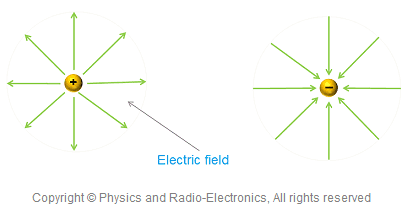
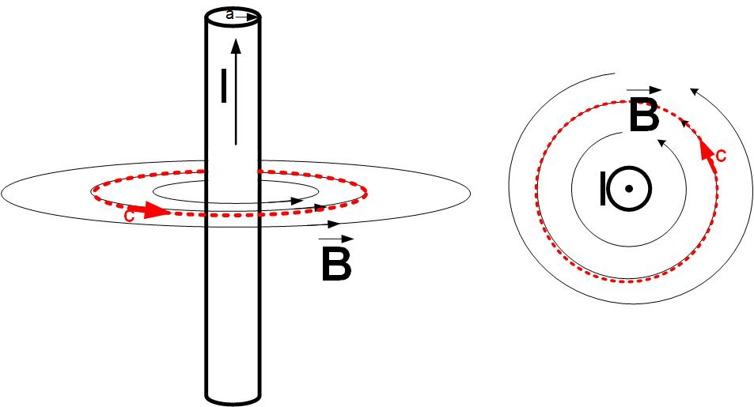
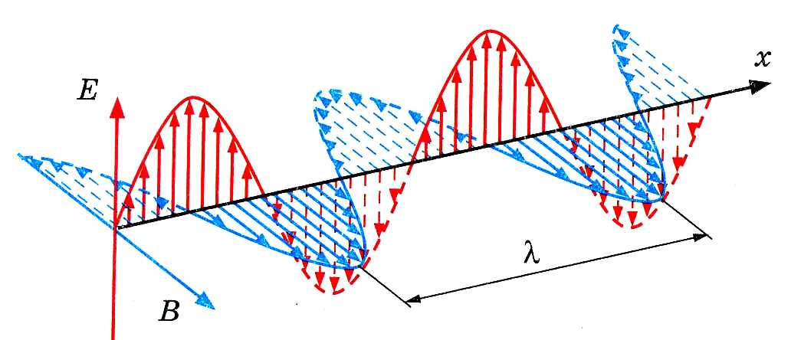
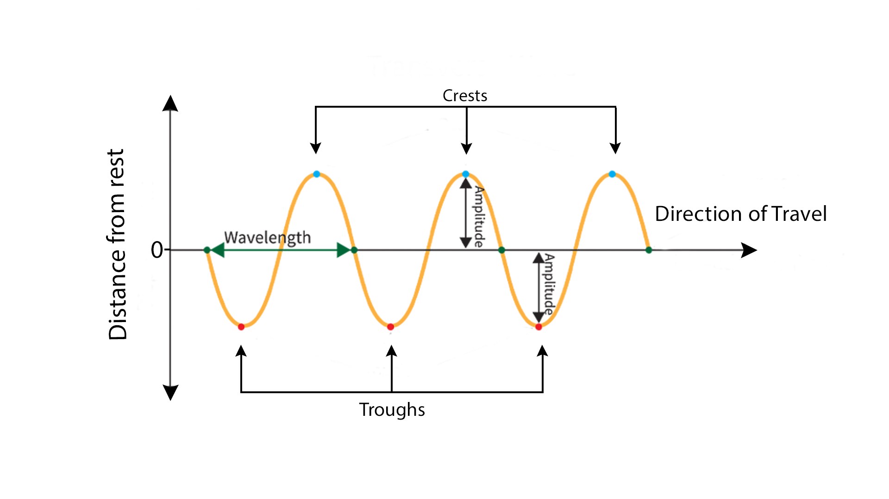
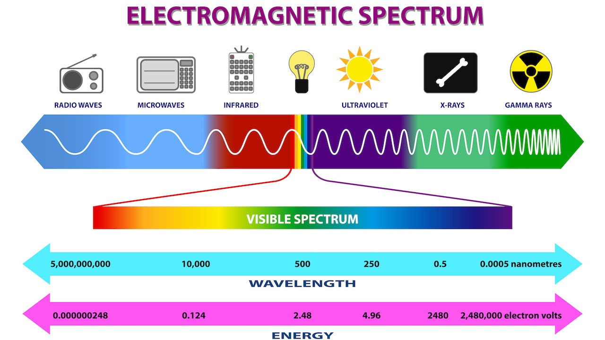

## Що таке електромагнітні хвилі?
Позитивний і негативний заряд створюють електричне поле в просторі навколо себе.

Якщо в провіднику проходить струм, навколо нього створюється магнітне поле (Закон Ампера).

Але з часом люди почали помічати, що є інший спосіб отримувати магнітне поле, а не тільки через струм. А також є інший спосіб створювати електричне поле, окрім як за допомогою електричних зарядів.  
Виявляється, якщо ми маємо змінне електричне поле десь в ділянці простору, навіть якщо в цій ділянці не протікає електричний струм, сама зміна цього поля викликає створення магнітного поля. В свою чергу, коли магнітне поле створюється, воно теж змінюється з часом, і ця зміна магнітного поля викликає появу нового електричного поля. Таким чином створюється свого роду "ланцюгова реакція" з двох полів, які породжують одне одного. Цей процес відбувається безперервно, і в результаті утворюється **електромагнітна хвиля**, яка поширюється в просторі. І ці поля стають незалежними від джерела, яке їх створило.
  
Електричне і магнітне поля коливаються перпендикулярно одне одному і до напрямку поширення хвилі. Ці хвилі поширюються зі швидкістю світла (приблизно 300 000 км/с у вакуумі). Взагалі, світло є одним із видів електромагнітних хвиль. Тобто радіо і світло - це те саме, просто на різних частотах.

Ці хвилі схожі на механічні хвилі (наприклад, хвилі на поверхні води або звук), але на відміну від механічних хвиль, які потребують середовища для поширення (наприклад, вода або повітря), електромагнітні хвилі можуть поширюватися навіть у вакуумі.

### Як створити електромагнітні хвилі?  
В простому уявленні, необхідно або рухати заряд, що створює електричне поле (туди-сюди), таким чином ми весь час змінюємо електричне поле і тим самим змінюємо і магнітне. Або весь час змінювати напрям струму в провіднику (як в антенах), тим самим змінюючи електричне поле, що в свою чергу буде створювати змінне магнітне поле.

### Трохи про властивості хвиль
 

**Амплітуда хвилі** - максимальне відхилення поля від нуля. В електромагнітних хвилях амплітуда може бути пов'язана з інтенсивністю світла або силою радіосигналу.  
**Довжина хвилі** - відстань між двома послідовними точками, які знаходяться в однаковій фазі коливання (наприклад, від однієї вершини до наступної вершини). Позначається буквою λ (лямбда) і вимірюється в метрах (м).  
**Період коливання** - час, за який хвиля робить одне коливання (повертається до початкового стану). Позначається буквою T і вимірюється в секундах (с).  
**Частота коливання** - кількість коливань за одиницю часу. Позначається буквою f і вимірюється в герцах (Гц). 1 Гц = 1 коливання за секунду.  
Між періодом і частотою існує обернена залежність:  
$$ f = \frac{1}{T} (1)$$

**Швидкість поширення хвилі** - швидкість, з якою хвиля рухається в просторі. Позначається буквою v і вимірюється в метрах на секунду (м/с).  
Оскільки хвиля проходить одну довжину хвилі за один період, швидкість можна виразити як:   
$$ v = \frac{\lambda}{T} (2)$$
Звідси випливає основне рівняння хвиль:   
$$ v = f \cdot \lambda $$
Швидкість світла - величина стала, тому коли ми змінюємо частоту хвилі, довжина хвилі змінюється відповідно, щоб швидкість залишалася сталою.
$$v = f \uparrow \lambda \downarrow$$
і навпаки  
$$v = f \downarrow \lambda \uparrow$$

### Електромагнітний спектр

