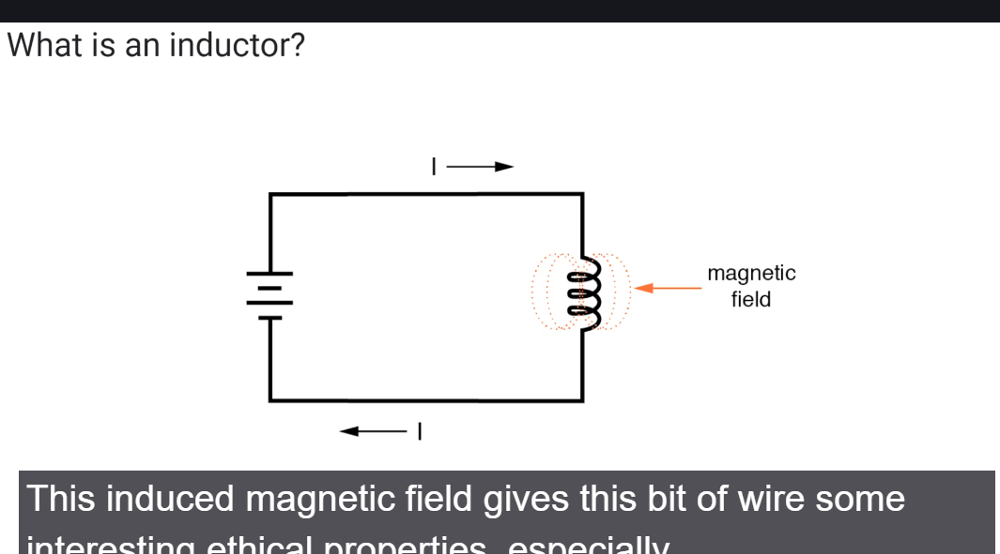
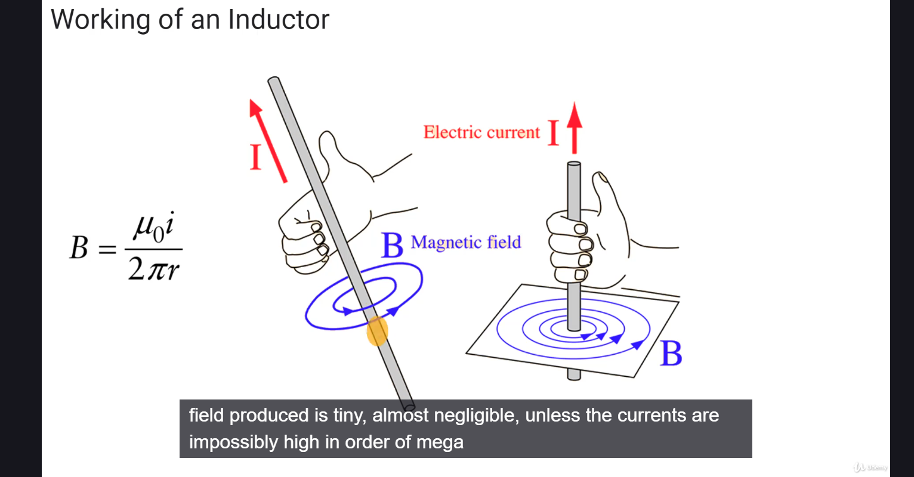
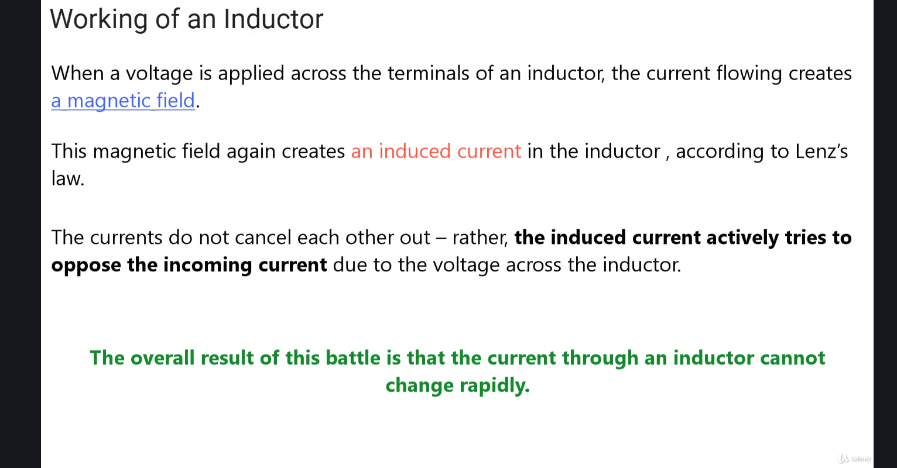

  
Коли струм проходить по котушці індуктивності, створюється магнітне поле.  

.png>)  
Є котушки з різним осердям (core). Осердя - це матеріал навколо якого намотано провід котушки.  

Коли по дроту іде електричний струм, навколо нього створюється магнітне поле. Але воно занадто слабке.   
  

Для того, щоб збільшити магніте поле, яке створюється дротом певної довжини, необхідно намотати цей дріт в котушку.   
-1.png>)  

# Наскільки правильно те, що тут написано
   

Показати/Сховати

Коротко: **ідея правильна, але пояснення трохи спрощене і місцями неточне**. Давай розберемо по рядках 👇

---

## Що правильно

### ✔️ 1. “Струм створює магнітне поле”

Це **абсолютно правильно**.

---

### ✔️ 2. “Магнітне поле пов’язане з індукцією”

Так, але тут важливе уточнення:

> індукція виникає не просто від поля, а від **зміни магнітного поля**

---

## Де є неточність

### ❌ “магнітне поле створює індукований струм”

Це **не зовсім правильно сформульовано**.

Правильно так:

> **зміна магнітного потоку** створює ЕРС (напругу), яка може викликати струм

Тобто:

* не поле саме по собі
* а **його зміна**

---

## Найбільша проблема 👇

### ❌ “induced current opposes the incoming current”

Це звучить ніби:

> є два струми, які “борються”

Але це **не фізично коректна картина**.

---

## Як правильно розуміти

У котушці відбувається так:

1. Ти прикладаєш напругу
2. Починає рости струм
3. Через це змінюється магнітне поле
4. Зміна поля створює **ЕРС самоіндукції**

І ось ключове:

> ця ЕРС **протидіє зміні струму**, а не самому струму

---

## Правильна формула

$
V = L \frac{dI}{dt}
$

👉 індуктивність реагує на **швидкість зміни струму**, а не на сам струм

---

## Інтуїтивно

Котушка поводиться як “інерція” для струму:

* хочеш швидко збільшити струм → вона “гальмує”
* хочеш швидко зменшити → теж “гальмує”

---

## Чому їх формулювання вводить в оману

Фраза:

> “induced current opposes incoming current”

може змусити думати, що:

* є два різних струми
* вони взаємно знищуються

Але реально:

* є **один струм**
* є **напруга, яка заважає його змінювати**

---

## Останнє речення

### ✔️ “current cannot change rapidly”

Це **повністю правильно** 👍
І це головний практичний висновок.

---

## Підсумок

| Твердження                      | Оцінка                           |
| ------------------------------- | -------------------------------- |
| Струм створює магнітне поле     | ✅                                |
| Поле створює індукований струм  | ⚠️ (тільки якщо поле змінюється) |
| Струми “протидіють один одному” | ❌                                |
| Струм не може різко змінюватись | ✅                                |

---

## Якщо зовсім правильно сказати

> Котушка створює напругу, яка протидіє зміні струму через неї.

---

Якщо хочеш, можу пояснити ще глибше:

* звідки береться ця “протидіюча” напруга на рівні полів
* або показати це через енергію поля (там дуже гарна інтуїція)

# чому створюється ЕРС самоіндукції?  
## Чому виникає ЕРС самоіндукції

Коротка суть:

> **ЕРС самоіндукції виникає тому, що змінне магнітне поле створює електричне поле**

І це не “ефект котушки”, а **фундаментальний закон природи**.

---

## 1. Головний закон

Це описує закон Фарадея:

\mathcal{E} = - \frac{d\Phi}{dt}

* ( \Phi ) — магнітний потік
* знак “–” → закон Ленца (протидія зміні)

---

## 2. Що реально відбувається в котушці

Крок за кроком:

1. Ти змінюєш струм
2. → змінюється магнітне поле
3. → змінюється магнітний потік
4. → виникає електричне поле
5. → це поле і є **ЕРС самоіндукції**

---

## 3. Важливий момент (який часто пропускають)

> ЕРС — це НЕ “струм, який з’явився”
> це **електричне поле, яке виникло в просторі**

І це поле:

* діє на заряди
* намагається їх рухати
* створює напругу

---

## 4. Чому воно протидіє зміні

Оце ключ 🔥

Якби цього не було:

* ти міг би миттєво змінювати струм
* без витрат енергії
* і отримати “безкоштовну енергію”

Але в реальності:

> поле “чинить опір” зміні, щоб зберігалася енергія

---

## 5. Через енергію (найкраще інтуїтивне пояснення)

Магнітне поле містить енергію:

$
W = \frac{1}{2} L I^2
$

Що це означає:

* щоб збільшити струм → треба “накачати” енергію в поле
* поле “не хоче” миттєво змінюватись
* тому виникає ЕРС, яка гальмує зміну

---

## 6. Дуже проста аналогія

Котушка ≈ маса в механіці

* маса чинить опір зміні швидкості (інерція)
* котушка чинить опір зміні струму

👉 ЕРС самоіндукції = “електрична інерція”

---

## 7. Найглибший рівень

З точки зору рівнянь Максвелла:

> змінне магнітне поле **обов’язково створює вихрове електричне поле**

Тобто:

* не “котушка придумала” ЕРС
* це властивість самого простору

---

## Підсумок

* Зміна струму → зміна магнітного поля
* Зміна поля → створює електричне поле
* Це поле → і є ЕРС самоіндукції
* Воно → протидіє зміні струму (закон Ленца)
* Причина → фундаментальні закони електромагнетизму + збереження енергії

---

Якщо хочеш, можу показати:

* як це виглядає прямо в провіднику (на рівні електронів)
* або пояснити, чому ЕРС існує навіть без дроту (це ще більш “вау”-момент)

# як це виглядає прямо в провіднику?

## Як виглядає самоіндукція прямо всередині провідника

Давай “зумнемося” до рівня електронів у дроті 👇

---

## 1. Початковий стан

У провіднику є:

* вільні електрони
* іони кристалічної решітки

Без напруги:

> електрони рухаються хаотично → струму нема

---

## 2. Ти прикладаєш напругу

З’являється **електричне поле вздовж провідника**:

* воно починає “тягнути” електрони
* виникає струм

Але! У котушці відбувається ще одна штука 👇

---

## 3. Рух електронів створює магнітне поле

Кожен рухомий електрон → створює магнітне поле

У сумі:

> навколо провідника формується загальне магнітне поле

---

## 4. Коли струм ЗМІНЮЄТЬСЯ

Оце ключовий момент.

Якщо струм:

* збільшується → магнітне поле росте
* зменшується → поле слабшає

---

## 5. Що відбувається з полем

Змінне магнітне поле:

> створює **вихрове електричне поле прямо в просторі**

І це дуже важливо:

* це поле **не від батарейки**
* воно виникає саме по собі (за законами Максвелла)

---

## 6. І ось що відчувають електрони

Тепер у провіднику є ДВА поля:

1. 🔵 поле від джерела (штовхає вперед)
2. 🔴 індуковане поле (штовхає назад)

---

## 7. На рівні одного електрона

Уяви один електрон:

* батарейка тягне його → вперед
* індуковане поле → гальмує

👉 результат:

> електрон розганяється НЕ миттєво

---

## 8. Що це означає фізично

* електрони не “стикаються зі стінкою”
* немає другого струму
* є **суперпозиція полів**

Тобто:

> сили складаються, а не струми “борються”

---

## 9. Дуже важливий момент

Це індуковане поле:

* існує навіть у вакуумі
* провідник просто дає електронам “на що реагувати”

---

## 10. Чому це виглядає як інерція

Бо:

* щоб змінити струм → треба змінити поле
* щоб змінити поле → треба змінити енергію

👉 система “опирається” зміні

---

## 11. Найточніше формулювання

> В провіднику ЕРС самоіндукції — це електричне поле, створене змінним магнітним полем, яке діє на ті ж самі електрони і протидіє зміні їх руху.

---

## Супер-коротко

* електрони рухаються → створюють поле
* поле змінюється → створює нове електричне поле
* це поле → гальмує зміну руху електронів

---

## Якщо хочеш ще глибше

Можу пояснити:

* як це виглядає через **енергію поля в просторі (не в дроті!)**
* або через **релятивістське пояснення на рівні зарядів** — там ще цікавіше 😄

.png>)  
На графіку видно, що в схемі справа після замкнення ключа струм збільшується не моментально, а набирає амплітуду поступово, бо йому противиться ЕРС.

Зазвичай котушки не використовуються в колах прямого струму. Їх частіше застосовують в колах змінного струму. 