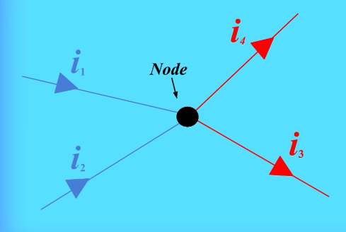
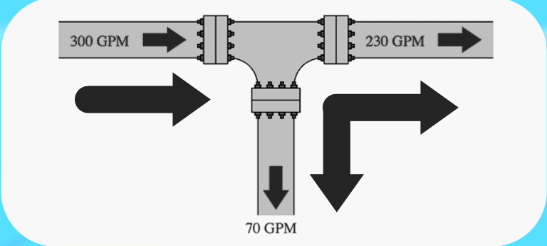

# Закон вузлів Кірхгофа (KCL)
 
    Струм, що входить у вузол(з'єднання) повинен дорівнювати струму, що виходить із цього вузла. Це наслідок закону збереження заряду, оскільки заряд не може накопичуватися в вузлі.

<!-- $\sum I_{in} = \sum I_{out}$ -->

∑Iin = ∑Iout

i₁ + i₂
 = 
i₃ + i₄

    Вузол - це зєднання двох або більше провідників в електричному колі.

По аналогії з водопроводом, якщо в одну трубу входить 10 літрів води за хвилину, а в другу трубу входить 5 літрів за хвилину, то з вихідної труби має виходити 15 літрів за хвилину, інакше вода буде накопичуватися або витікати з труби.
