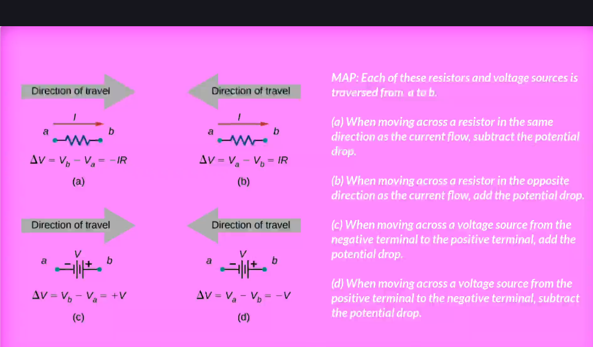
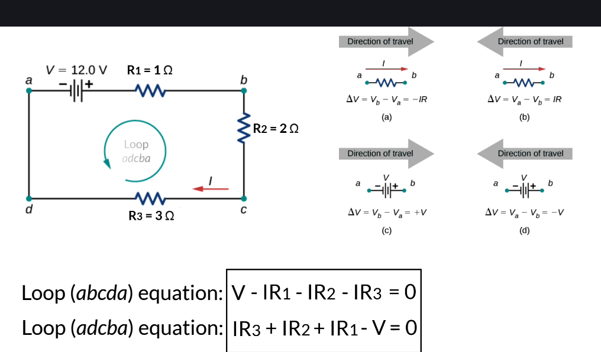

    By applying Kirchhoff's rules, we generate a set of linear equations that allow us to find the unknown values in circuits.

    These may be currents, voltages, or resistances.

    Each time the rule is applied, a new equation is generated.

І якщо нерівностей так само багато, як і невідомих, то ми можемо розв’язати систему рівнянь і знайти всі невідомі величини.

## Problem-Solving Strategy: kirchhoff's Rules
1. label the points in the circuit diagram using lowercase letters a, b, c, ... These labels help with orientation.
2. Locate the nodes in the ciruit. Label each node with the currents and directions into and out of it. Make sure at least one current points into the node and at least one current points out of the node.
3. Choose the loops in the circuit. Every component must be contained in at least one loop. But the component can be contained in more than one loop.
4. Apply Kirchhoff's Current Law. You only need to use enough nodes to include every current.
5. Apply Kirchhoff's Voltage Law. (Use the map for help)

## Приклад
