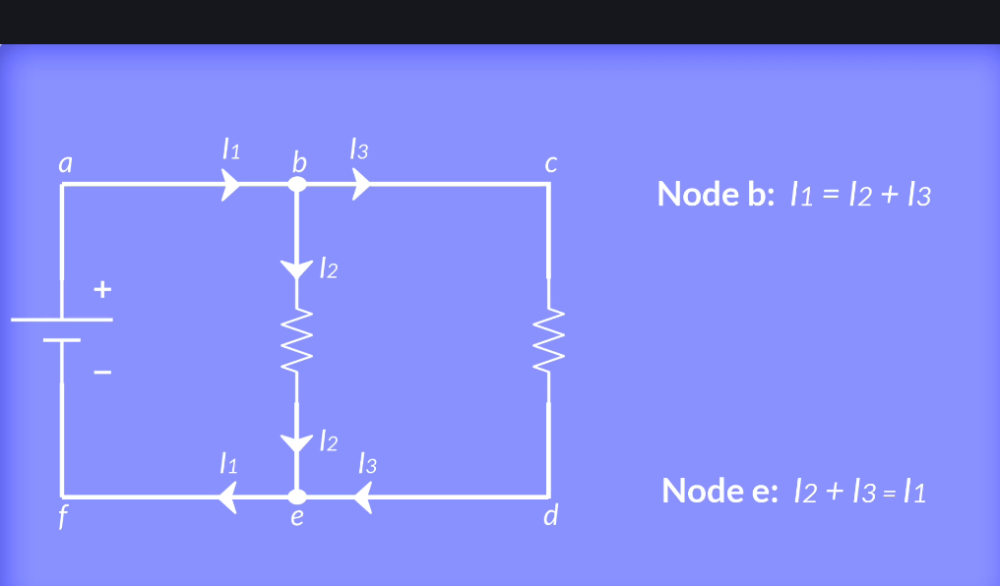
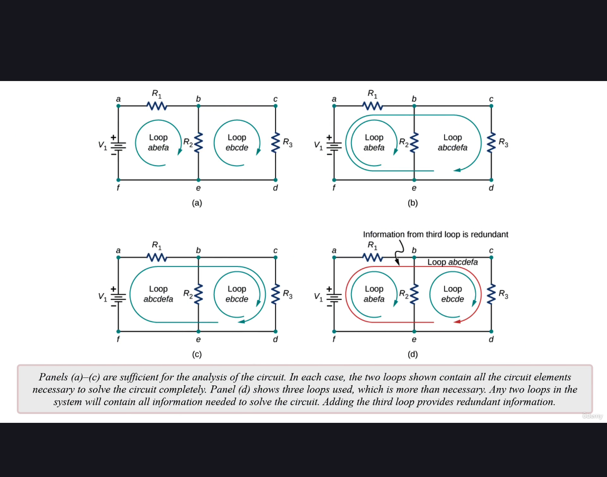

Ми можемо проігнорувати один з вузлів (b або c) при застосуванні закону вузлів Кірхгофа, оскільки вони є еквівалентними. З них випливає два однакові рівняння:

$I_1 = I_2 + I_3$ та $I_2 + I_3 = I_1$

## Яким чином обрати контури для застосування закону контурів Кірхгофа?
