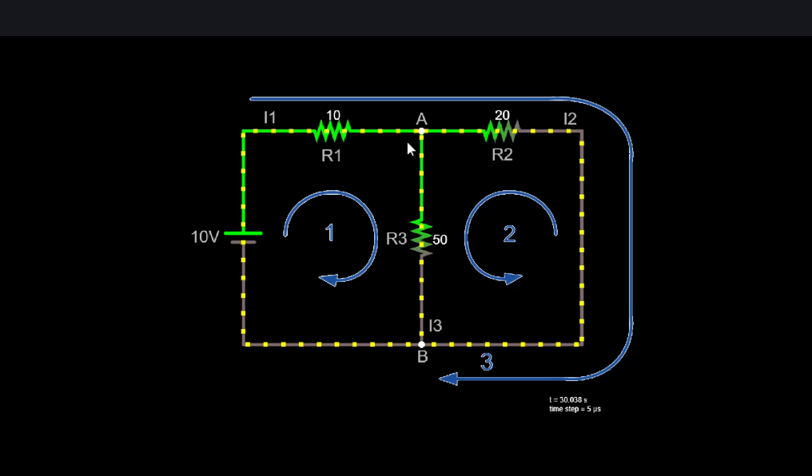

## Приклад
Розглянемо наступну схему:

Тут є три лупи (контури).
Перше рівняння випливає із закону вузлів:
$$I_1 = I_2 + I_3 (1)$$
Друге рівняння випливає із закону контурів, застосованого до контуру 1 (ідемо за годинниковою стрілкою):
$$10V - I_1R_1 - I_3R_3 = 0 (2)$$
Третє рівняння випливає із закону контурів, застосованого до контуру 2 (ідемо проти годинникової стрілки). Коли йдемо по резистору $R_2$, ми йдемо проти напрямку струму, тому знак плюсовий, коли йдемо по резистору $R_3$, ми йдемо за напрямком струму, тому знак мінусовийё:
$$I_2R_2 - I_3R_3 = 0 (3)$$
Рівняння, яке випливає з третього контуру, цей контур НЕ іде по резистору $R_3$:
$$10V - I_1R_1 - I_2R_2 = 0 (4)$$
Із рівнянь (2), випливає:
$$I_2 = \frac{I_3R_3}{R_2}$$
Підставивши значення опорів отримуємо:
$$I_2 = \frac{5\Omega I_3}{2\Omega}(5)$$
Замінюємо $I_1$ в рівнянні (1), беремо його з рівняння (1):
$$10V - (I_2 + I_3)R_1 - I_3R_3 = 0 (6)$$
Тепер підставляємо в (6) $I_2$ з рівняння (5):
$$10V - \left(\frac{5\Omega I_3}{2\Omega} + I_3\right)R_1 - I_3R_3 = 0$$
Підставивши значення опорів, отримаємо:
$$I_3 = 117 mA$$
Підставляючи це значення в рівняння (5), отримаємо:
$$I_2 = 292 mA$$