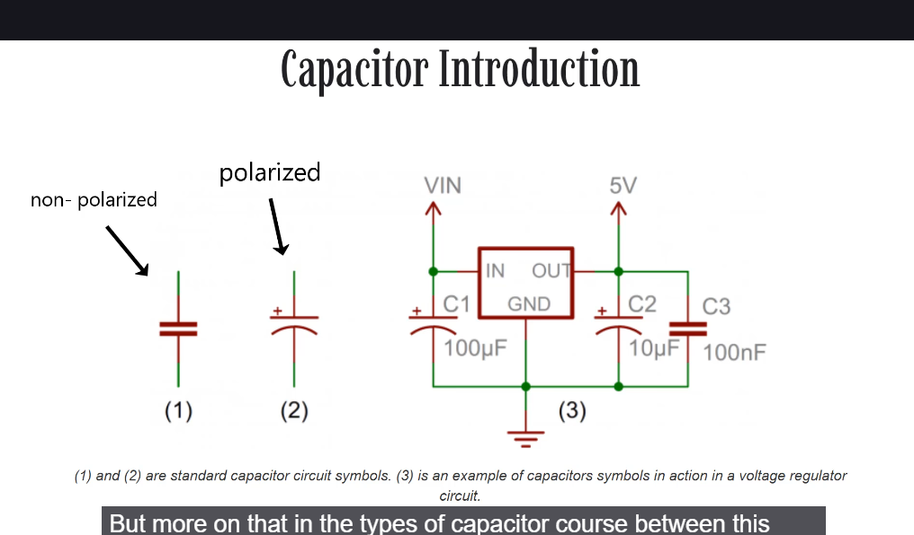
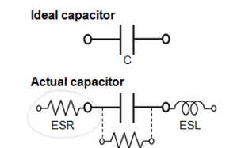

# Конденсатори: вступ

На малюнку показано, як позначені поляризовані (зазвичай електролітичні) та неполяризовані конденсатори в електричних схемах.
# Capacitance
The capacitance of a capacitor tells you **how much charge it can store**, more capacitance means more capacity to store charge.

## When deciding on capacitor types there are a handful of factors to consider:
- **Size** - Size both in termas of physical volume and capacitance. More capacitance typically requires a larger capacitor.
- **Maximum voltage** - Each capacitor is rated for a maximum voltage that can be dropped acrross it.
- **Leakage current** - Every cap is prone to leaking some tiny amount of current through the dielectric, from one terminal to the other.
- **Equivalent Series Resistance (ESR)** - The terminals of a capacitor aren't 100% conductive, they'll always have a tiny amount of resistance (usually less than 0.01 ohm) to them. This resistance becomes a problem when a lot of current runs through the cap, producing head and power loss.

- **Tolerance** - Capacitors also can't be made to have an exact, precise capacitance. Each cap will be rated

