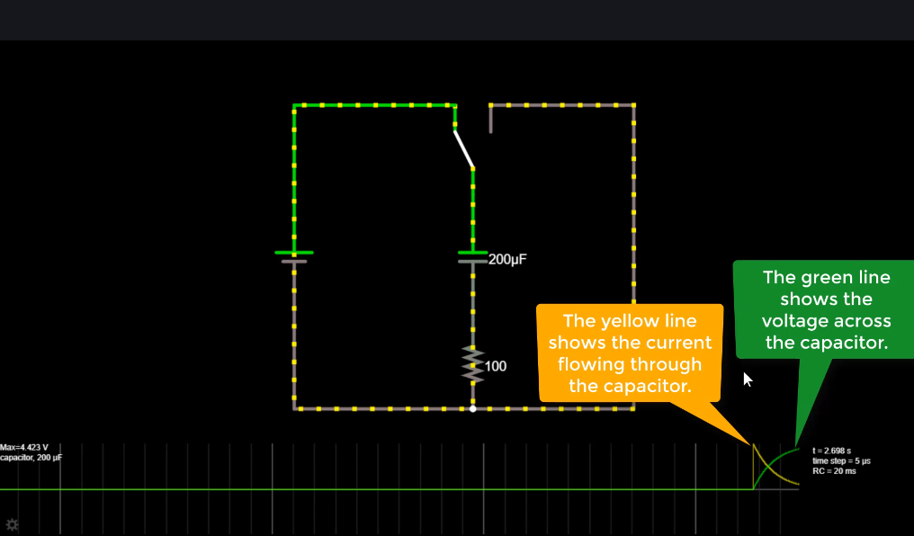

Коли ми замикаємо коло на конденсатор, він певний час заряджається, До нього тече струм до тих пір, поки він не зарядиться повністю. Після цього струм припиняється, і конденсатор зберігає заряд (напругу). Коли ми замикаємо ключ в іншу сторону, конденсатор починає розряджатися і струм тече в протилежному напрямку (негативний струм), поки конденсатор не розрядиться повністю.
Резистор в колі додається, бо в симуляторі ідеальний конденсатор та ідеальне джерело струму, що не мають внутрішнього опору. Через це без резистора (в теорії та симуляторі для ідеальних компонентів) струм буде нескінченним (за законом Ома). Симулятор не допускає нескінченний струм при замиканні кола, тому треба додати резистор.
.png>)