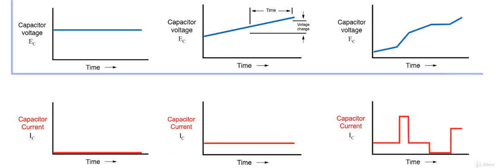

**Ємність конденсатора** [вимірюється в фарадах (F)] визначає, скільки заряду він може зберігати.  
Кількість заряду, яку конденсатор зберігає в даних момент залежить від різниці потенціалів (напруги) між його пластинами.  
$$Q = C \cdot V$$
Заряд (Q) в конденсаторі дорівнює добутку його ємності (C) та напруги (V) між його пластинами (в певний момент часу).  
## Струм в конденсаторі
Струм - це швидкість потоку заряду.  
Кількість заряду, що проходить через конденсатор залежить від ємності та від швидкості збільшення або зменшення напруги.  
  
Графіки попарно показують, яким чином струм залежить від напруги.  
На першій парі видно, що при сталій напрузі, струм дорівнює нулю (конденсатор заряджений).  
На другій парі видно, що при лінійному збільшенні напруги, струм є позитивним і **сталим**. Ми весь час **лінійно** збільшуємо напругу, щоб підтримувати сталий струм, бо якби напруга була стала (наприклад 5В), струм би почав зменшуватися, оскільки конденсатор заряджається і тим самим відштовхує нові заряди, що на нього приходять.  
На третій парі показано лінійні зміни напруги з різною швидкістю і тим самим проходять різні струми. Тут можна побачити, що струм залежить від **швидкості зміни напруги**, а не від її величини. Бо хоч напруга і збільшується весь час, струм в моменти, коли швидкість зміни напруги зменшуєтьяся, також зменшується. Якщо зміни напруги немає, то немає і струму.

Якщо напруга стала, спостерігаємо наступну картину:  
.png>)  
Як тільки замкнули ключ, напруга на конденсаторі поступово зростає (зелений графік), а струм поступово (експоненціально) зменшується (жовтий графік).  

Формула для обчислення струму через конденсатор:  
$$I = C \cdot \frac{dV}{dt}$$
Струм (I) через конденсатор дорівнює добутку його ємності (C) та швидкості зміни напруги (dV/dt).  
**Важливо**: ця формула працює тільки для лінійної зміни напруги.  
$\frac{dV}{dt}$ - це похідна напруги за часом. Це те ж саме що сказати "як швидко змінюється напруга в цей момент часу".  
З цього рівняння випливає, що якщо напруга стала (незмінна), похідна дорівнює нулю (похідна від сталого значення дорівнює нулю), що означає, що струм також дорівнює нулю. Через це струм і не може текти через конденсатор, що заряджений до певної напруги.  