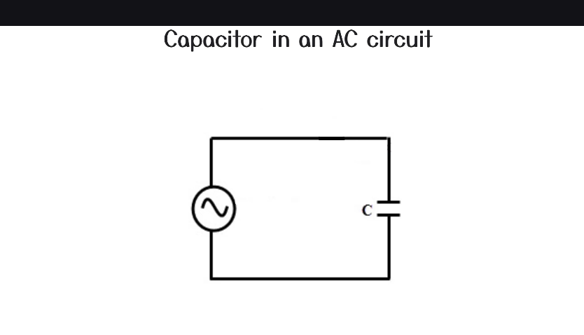

  
В колі змінного струму конденсатор весь час заряджається і розряджається.  
.png>)  
У колі змінного струму, де є тільки резистор, напруга і струм знаходяться в одній фазі, тобто струм змінюється прямо пропорційно напрузі.  
.png>)  
У колі змінного струму з чисто одним конденсатором, струм випереджає напругу на 90 градусів ($\frac{\pi}{2}$ радіан).  
Чому так відбувається?  
.png>)  
На попередньому уроці пояснювалося, що струм залежить від швидкості зміни напруги.  на цих графіках видно, що коли напруга змінюється, тоді тече струм. Коли напруга стала, струм не тече.  
Формула залежності струму від швидкості зміни напруги:  
$$I = C \frac{dV}{dt}$$
.png>)  
Якщо подивитися на початок цього графіку, видно, що з часом **швидкість зміни напруги** зменшується (графік стає менш похилим), поки напруга не доходить до піку максимуму (до $\frac{\pi}{2}$), протягом цього відрізку часу струм поступово зменшується, поки не стає нулем (коли напруга по суті стала). Далі в проміжку від $\frac{\pi}{2}$ до $\pi$ напруга знову змінюється, але в негативному напрямку, **швидкість зміни** напруги тепер **зростає**(графік стає більш похилим), тому струм з часом зростає, але в негативному напрямку.  
Далі по такій же логіці від $\pi$ до $\frac{3\pi}{2}$ швидкість зміни напруги зменшується, тому струм знову зменшується (але в негативному напрямку) і стає нулем на піку напруги, а від $\frac{3\pi}{2}$ до $2\pi$ швидкість зміни напруги знову зростає, тому струм знову зростає, але в позитивному напрямку.  

    Через конденсатори не тече постійний струм (один раз зарядився і вже струм не проходить), але вони пропускають змінний струм (весь час іде зарядка і розрядка і в цей час в колі постійно протікає струм в різні сторони).