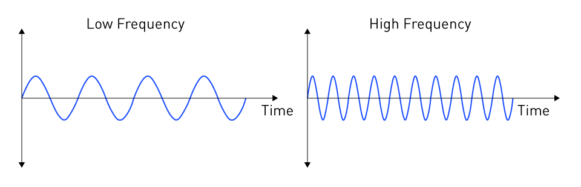

# Чому реактивний опір обернено пропорційний частоті змінного струму
Формула
$
X_C = \frac{1}{2\pi f C}
$
— це **ємнісний опір (реактивний опір) конденсатора** в колі змінного струму. Вона з’являється безпосередньо з рівняння струму через конденсатор.

$
\boxed{X_C = \frac{1}{2\pi f C}}
$

---

# 🔎 Фізичний сенс

Формула показує:

* 🔺 Чим більша частота — тим **менший опір**
* 🔺 Чим більша ємність — тим **менший опір**
* При $f=0$ (постійний струм) → $(X_C \to \infty)$

Тому конденсатор:

* блокує DC
* пропускає високі частоти

---

# 🧠 Інтуїтивне пояснення

Струм у конденсаторі залежить від швидкості зміни напруги (див 45.1).

* Низька частота → напруга змінюється повільно → струм малий → великий опір (точніше сказати: великий опір → малий струм)
* Висока частота → напруга змінюється швидко → струм великий → малий опір (похиліші графіки напруги → більший струм)  

---
---
---

# питання: а чи не логічно, що чим більша частота, тим струм не встигає досягнути своїх висот як при низькій частоті?
Дуже класне питання 👌
І воно абсолютно логічне — але тут є тонкий момент.

Ти мислиш так:

> якщо частота більша → період менший → сигнал “не встигає розігнатися”

Це інтуїтивно звучить правильно… **для систем з інерцією** (механіка, індуктивність, маса, RL-коло).
Але конденсатор працює інакше.

---

# 🔬 Ключовий момент

Для конденсатора:

$
i = C \frac{du}{dt}
$

Струм залежить **не від самої напруги**, а від **швидкості її зміни**.

---

## 📈 Що відбувається при високій частоті?

Якщо:

$
u(t)=U_m \sin(\omega t)
$

то при знаходженні похідної (Якщо щось змінюється — похідна показує, наскільки швидко воно змінюється в конкретний момент часу) отримаємо:

$
\frac{du}{dt} = U_m \omega \cos(\omega t)
$

Бачиш? З’являється множник **ω = 2πf** (залежний від частоти $f$).

👉 Чим більша частота → тим більша похідна (швидкість зміни напруги) → тим більший струм.

Тобто:

* напруга може не встигнути набрати максимум
* але швидкість її зміни стає більшою
* а саме це і визначає струм

---

# 🧠 Інтуїція без формул

Уяви:

* Конденсатор — це ніби бак з еластичною мембраною
* Напруга — це тиск
* Струм — це потік води

Якщо ти:

* повільно качаєш тиск → вода тече повільно
* дуже швидко змінюєш тиск → вода рветься туди-сюди значно інтенсивніше

---

# ⚡ Чому твоя логіка працює для котушки, але не для конденсатора?

Для індуктивності:

$
u = L \frac{di}{dt}
$

Там уже **струм** залежить від швидкості зміни.
Тому при великій частоті струм “не встигає” — і опір росте:

$
X_L = 2\pi f L
$

Тобто:

| Елемент     | При ↑ f          |
| ----------- | ---------------- |
| Конденсатор | струм ↑ → опір ↓ |
| Котушка     | струм ↓ → опір ↑ |

---

# 🔥 Головна різниця

* Конденсатор "реагує" на зміну напруги
* Котушка "противиться" зміні струму

---

Якщо хочеш, можу намалювати фазові діаграми та показати, чому струм у конденсаторі випереджає напругу на 90°.

---
---
---

# питання: чому реактивний опір обернено пропорційний ємності конденсатора?
Загальна формула ємності: 
$$\boxed{C = \frac{\varepsilon S}{d}}$$
де:
* $\varepsilon$ - діелектрична проникність матеріалу між пластинами
* $S$ - площа пластин
* $d$ - відстань між пластинами  

в моєму інтуїтивному уявленні як приклад: у конденсатора з більшими пластинами більша ємність. Чим більші пластини, тим тій же самій напрузі "легше" заганяти електрони на ці пластини, бо вони чинять менше опору новим електронам, бо між ними банально більша відстань (через більшу площу). А чим більша відстань між електронами (в межах однієї пластини, це називається густина заряду), тим з меншою силою вони відштовхуються.  
Коли пластина більша:

* при тій самій напрузі заряд розподіляється на більшій площі
* густина заряду (заряд на м²) менша
* електричне поле слабше концентроване
* щоб створити ту саму напругу, потрібно більше заряду

Тобто:

$$
Q = C U
$$

Якщо (C) велике → треба більше заряду для тієї ж напруги.

А більше заряду → більший струм при зміні напруги → менший ($X_C$).  

В моєму інтуїтивному уявленні щодо відстані між пластинами: чим менша відстань між пластинами, тим краще позитивні заряди з іншої пластини притягують до себе негативні заряди на іншій пластині. ~~Тим самим різниця потенціалів більша~~ (різниця потенціалів або зменшується у випадку з ізольованим конденсатором, а для кола з джерелом напруги, різниця потенціалів підтримується джерелом (тобто стала), **але збільшується накопичений між пластинами заряд**), ~~а отже з цього можна зробити висновок, що опір менший~~.

---

# 🔹 Ключова формула

$$
X_C = \frac{1}{2\pi f C}
$$

Питання: **чому при більшій ємності опір менший?**

---

# 🔬 Почнемо з базового закону

Для конденсатора:

$$
i = C \frac{du}{dt}
$$

Струм прямо пропорційний ємності.

Тобто якщо:

* (C) більше → при тій самій швидкості зміни напруги струм більший

А реактивний опір — це:

$$
X_C = \frac{U}{I}
$$

Якщо струм більший → відношення (U/I) менше → опір менший.

---

# 🧠 Інтуїція без формул

Ємність — це здатність накопичувати заряд:

$$
Q = C U
$$

Якщо (C) велика:

* той самий невеликий приріст напруги створює великий приріст заряду
* щоб заряд швидко перерозподілився — тече більший струм

Тобто більша ємність = легше “ганяти заряд” = менший опір змінному струму.

---

# ⚡ Фізична аналогія

Уяви два баки з гумовою мембраною:

* Маленький бак (мала C)
  → невелика зміна тиску → мало води перетікає

* Великий бак (велика C)
  → та сама зміна тиску → багато води перетікає

Більший потік = більший струм. (тобто ємність - це розмір бака, який треба заповнити)

---

# 🔍 Через амплітуди

Якщо:

$$
I_m = C \omega U_m
$$

то:

$$
X_C = \frac{U_m}{I_m} = \frac{1}{C \omega}
$$

Тут прямо видно:

* подвоїв C → подвоїв струм → вдвічі зменшив опір

---

# 🎯 Головна причина

Реактивний опір обернено пропорційний ємності, тому що:

> Конденсатор тим менше “перешкоджає” змінному струму, чим легше він накопичує та віддає заряд.

---
---
---

# питання:чи можна сказати що реактивний опір це "усереднений опір"?
Коротко: **ні, реактивний опір — це не “усереднений опір”**.
Але я розумію, чому так хочеться сказати 🙂

---

# 🔹 Що таке реактивний опір насправді?

Реактивний опір (X) — це **міра того, наскільки елемент заважає змінному струму через накопичення енергії**, а не через її розсіювання.

* Для конденсатора:
  $$
  X_C = \frac{1}{2\pi f C}
  $$
* Для котушки:
  $$
  X_L = 2\pi f L
  $$

Це не опір у звичайному сенсі (як резистор).

---

# 🔥 Головна різниця

| Тип                   | Що робить з енергією       | Чи гріється   |
| --------------------- | -------------------------- | ------------- |
| Резистор              | розсіює в тепло            | так           |
| Конденсатор / котушка | накопичує і повертає назад | ні (ідеально) |

Тому реактивний опір — це **не втрати**, а **фазове протистояння зміні**.

---

# 🧠 Чому це не “усереднений”?

“Усереднений опір” звучить так, ніби:

* струм то великий, то малий
* і ми беремо середнє значення

Але (X_C) і (X_L) з’являються не через усереднення,
а через співвідношення **амплітуд**:

$$
X = \frac{U_{max}}{I_{max}}
$$

Тобто це аналог закону Ома для синусоїд, але з фазовим зсувом (див 46).

---

# 🔎 Що тоді ближче до "усередненого"?

Якщо вже шукати аналогію, то ближче:

* **Ефективне (RMS) значення**
* або **еквівалентний імпеданс**

Але навіть це не зовсім “усереднення”.

---

# ⚡ Інтуїтивно

Реактивний опір — це:

> “наскільки елемент протидіє зміні, зберігаючи енергію у полі”

* Конденсатор → в електричному полі
* Котушка → в магнітному полі

---

# 🎯 Ключова ідея

Реактивний опір — це **не про величину струму в середньому**,
а про **фазовий зсув і обмін енергією**.

---
