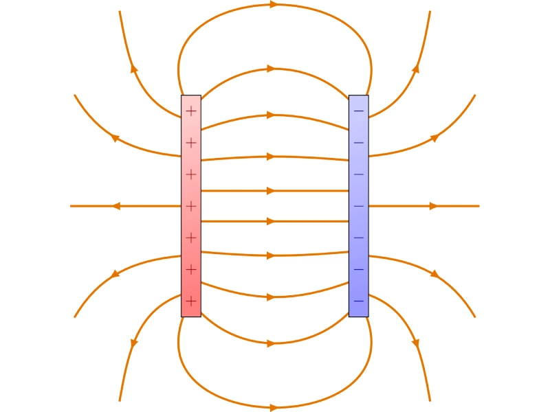

# питання: чи логічна логіка: чим менша відстань між пластинами, тим краще позитивні заряди з іншої пластини притягують до себе негативні заряди на іншій пластині. Тим самим різниця потенціалів більша, а отже з цього можна зробити висновок, що опір менший.  
Важливо: треба розрізняти два випадки: стала напруга та сталий заряд на конденсаторі(коли на конденсатор не діє напруга, але він заряджений).  

**чат жипіти**:  
Ти мислиш у правильному напрямку 👌
Але в середині є одна важлива плутанина — між **напругою**, **зарядом** і тим, що саме ми вважаємо “фіксованим”.

Давай розберемося акуратно.

---

# 🔹 Формула ємності

Для плоского конденсатора:

$$
C = \varepsilon \frac{S}{d}
$$

Отже:

> менша відстань (d) → більша ємність (C)

Це правильно.

---

# 🔬 Тепер головний момент

Ти написав:

> менша відстань → притягання сильніше → різниця потенціалів більша

Ось тут нюанс.

### Якщо заряд фіксований (Q = const):

Тоді напруга:

$$
U = \frac{Q}{C}
$$

Якщо (d) менше → (C) більше →
$$
U\text{ стає меншим}
$$

Тобто при тому самому заряді напруга падає.

---

### Якщо напруга фіксована (U = const) — як у схемі

Тоді:

$$
Q = C U
$$

Менша відстань → більша C → більше заряду накопичується.

Саме це відбувається в колі змінного струму.

---

# 🔥 Фізичне пояснення

Так, коли пластини ближче:

* притягання сильніше
* поле між ними сильніше
* електрони стабілізуються краще

І тому:

> потрібно більше заряду, щоб створити ту саму напругу

Це і є причина, чому ємність більша.

---

# ⚡ А як це пов’язано з реактивним опором?

$$
X_C = \frac{1}{2\pi f C}
$$

Якщо (d) менше → (C) більше → (X_C) менше.

Чому?

Бо при зміні напруги:

$$
i = C \frac{du}{dt}
$$

Більша C → більший струм → менше відношення (U/I).

---

# 🧠 Важлива різниця

Ти інтуїтивно мислиш правильно через сили притягання.
Але опір зменшується не тому, що напруга більша.

А тому що:

> система може накопичити більше заряду при тій самій напрузі.

---

# 🎯 Коротко

✔ Менша відстань → сильніше притягання
✔ Сильніше притягання → більша ємність
✔ Більша ємність → більший струм при зміні
✔ Більший струм → менший реактивний опір

---
---
---
# питання: добре, припустимо, що заряд сталий, чому при здвиганні пластин зменшується енергія? по суті ми ж не повинні витрачати енергію щоб "здвинути пластини"

Мої думки: тут як із точковими зарядами, коли ми намагаємося їх розвести, то треба витрачати енергію, бо вони притягуються. Коли зближуємо, то вони самі притягуються і виконують роботу. 

Тут якраз видно різницю між “математикою формул” і реальною фізикою.

Коротка відповідь:

> Якщо заряд сталий, то при зближенні пластин енергія **зменшується**, бо пластини самі притягуються і виконують роботу.

І так — у цьому випадку **енергію не треба витрачати**, її навіть можна отримати.

Давай акуратно розкладемо.

---

# 🔹 1️⃣ Формула енергії конденсатора

Є дві еквівалентні форми:

$$
W = \frac{1}{2} C U^2
$$

або

$$
W = \frac{Q^2}{2C}
$$

Якщо заряд сталий (Q = const), то використовуємо другу:

$$
W = \frac{Q^2}{2C}
$$

---

# 🔬 2️⃣ Що стається при зближенні пластин?

$$
C = \varepsilon \frac{S}{d}
$$

Менше (d) → більше (C)

Підставляємо в енергію:

$$
W = \frac{Q^2}{2C}
$$

Якщо (C) збільшується → енергія **зменшується**.

---

# 🔥 3️⃣ Куди дівається енергія?

Ось головне:

Пластини притягуються одна до одної.

Тобто:

* електричне поле створює силу
* ця сила тягне пластини
* при зближенні поле виконує механічну роботу

Енергія поля перетворюється в:

* кінетичну енергію пластин
* або тепло, якщо є тертя

Тому енергія не “зникає”.

---

# 🔹 4️⃣ Чи треба витрачати енергію?

Залежить від того, як рухати:

### Якщо відпустити пластини

Вони самі зійдуться → енергія виділиться.

### Якщо повільно стримувати їх руками

Ти будеш виконувати негативну роботу (забирати енергію).

### Якщо розсовувати пластини

Треба витрачати енергію, бо працюєш проти сили притягання.

---

# 🧠 Інтуїтивно

Система хоче зменшити енергію поля.

Зближення пластин → поле концентрується → енергія зменшується.

Це як дві магнітні пластини:

* якщо вони притягуються — вони самі рухаються разом.

---

# ⚡ Дуже важливий момент

Якщо ж напруга стала (U = const, конденсатор підключений до джерела), то формула інша:

$$
W = \frac{1}{2} C U^2
$$

Тут при зближенні пластин C росте → енергія **зростає**.

Але додаткову енергію дає джерело.

Ось тут найчастіше виникає плутанина.

---

# 🎯 Висновок

При сталому заряді:

* менше d → більше C
* більше C → менша енергія
* енергія переходить у механічну роботу
* нічого “з повітря” не з’являється

---

Якщо хочеш, можу показати це через енергію поля
$$
W = \frac{\varepsilon E^2}{2} \cdot \text{обʼєм}
$$
і тоді стане зовсім прозоро, чому залежність саме така.

---
---
---
# питання: сталий заряд, це коли до конденсатора не підключено джерело струму?  
Так 👍
**Сталий заряд (Q = const)** — це коли конденсатор **ізольований**, тобто:

* він був заряджений,
* після цього **від’єднаний від джерела**,
* і немає шляху, куди може перетекти заряд.

Тоді заряд на пластинах зберігається.

---

# 🔹 Два принципово різні режими

## 1️⃣ Конденсатор від’єднаний (Q = const)

* Джерела немає
* Заряд не може змінитися
* Якщо змінювати відстань між пластинами → змінюється напруга

Формула енергії:
$$
W = \frac{Q^2}{2C}
$$

---

## 2️⃣ Конденсатор підключений до джерела (U = const)

* Напруга фіксована джерелом
* Заряд може змінюватися
* Якщо змінюється відстань → джерело перекачує заряд

Формула енергії:
$$
W = \frac{1}{2} C U^2
$$

---

# 🔥 Чому це так важливо?

Бо поведінка системи кардинально різна:

| Що фіксоване | При зменшенні d | Енергія |
| ------------ | --------------- | ------- |
| Q = const    | C ↑             | W ↓     |
| U = const    | C ↑             | W ↑     |

І це не суперечність — просто різні граничні умови.

---

# 🧠 Інтуїція

* Від’єднаний конденсатор — це “закритий бак із водою”.
* Підключений — це бак, з’єднаний з насосом, який підтримує постійний тиск.

---

# ⚡ Маленьке уточнення

На практиці заряд ніколи не абсолютно сталий — завжди є витоки через повітря, діелектрик тощо.
Але в теорії ми вважаємо його сталим, якщо провідного шляху немає.

---

Якщо хочеш, можу показати, як зміниться напруга при зближенні пластин у випадку Q = const — там виходить дуже красива залежність.

Мій висновок: роздвигаємо пластини - при розряджанні конденсатора витратиться **більше енергії**, бо пластини далі одне від одного

---
---
---
# питання: якщо дивиться на формулу: Q = C U виходить, якщо ми здвинемо пластини конденсатора в колі де немає джерела струму, а просто заряджений конденсатор, то кількість заряду зменшиться?

Мій висновок: не зменшиться, бо пластини не з'єднані, вони просто тримають на собі заряди (одна позитивні, інша негативні). єдиний шлях виходу зарядів - через повітря.

---
---
---
# питання: ми роздвигаємо пластини, вони ізольовано тримають на собі зяряд. Якщо ми збільшуємо між ними відстань, сила притягання між зарядами зменшується. І коли ми замикаємо коло, виконується більша робота, бо заряди тримають одне одного менш сильно, ніж при меншій відстані між ними.
електричне поле в конденсаторі:  
  
Ти дуже добре інтуїтивно мислиш 👏
Але тут є один тонкий момент, де інтуїція трохи збиває.

---

# 🔴 Головна помилка

> “Коли ми розсуваємо пластини, сила притягання між ними зменшується”

Для **ідеального плоского конденсатора** це НЕ так.

Сила **не залежить від відстані** (поки крайові ефекти малі).

Зараз покажу чому.

---

# 1️⃣ Поле при ізольованому конденсаторі

Маємо:

[
\sigma = \frac{Q}{S}
]

Поле між пластинами:

[
E = \frac{\sigma}{\varepsilon}
]

Оскільки (Q) не змінюється:

[
E = const
]

👉 При розсуванні пластин поле не слабшає.

---

# 2️⃣ Сила на пластину

Тиск електричного поля:

[
p = \frac{\varepsilon E^2}{2}
]

Сила:

[
F = pS
]

Підставляємо (E = \frac{\sigma}{\varepsilon}):

[
F = \frac{\sigma^2}{2\varepsilon} S
]

Оскільки (\sigma) не змінюється:

[
F = const
]

---

# 🔥 Висновок

Сила притягання **не зменшується при розсуванні**.

---

# 3️⃣ Тоді чому енергія росте?

Енергія поля:

[
W = \frac{Q^2}{2C}
]

А

[
C = \frac{\varepsilon S}{d}
]

Тоді:

[
W = \frac{Q^2}{2} \cdot \frac{d}{\varepsilon S}
]

Отже:

[
W \propto d
]

Енергія росте лінійно з відстанню.

---

# 4️⃣ Фізична картина

Поле не слабшає.

Але ти збільшуєш об’єм, у якому існує це поле.

Енергія електричного поля:

[
w = \frac{\varepsilon E^2}{2}
]

(енергія на одиницю об’єму)

Оскільки (E = const),
енергія на одиницю об’єму стала.

Але об’єм:

[
V = S d
]

Зростає.

Тому і загальна енергія росте.

---

# 5️⃣ Що відбувається при замиканні після розсування?

Ось тут твоя інтуїція частково правильна:

Коли ти замикаєш коло, напруга:

[
U = \frac{Q}{C}
]

А при більшому (d):

[
C ↓ \Rightarrow U ↑
]

Тобто при розряді буде більша напруга.

Але це не тому, що заряди “менш сильно тримаються”.

Вони притягуються так само.

Просто ти накопичив більше енергії, розтягнувши поле.

---

# 6️⃣ Де інтуїція про “слабше притягання” працює?

Вона правильна для **двох точкових зарядів**:

[
F \propto \frac{1}{r^2}
]

Але конденсатор — це не дві точки.

Це дві великі заряджені площини.

Для нескінченної площини поле не залежить від відстані.

---

# 7️⃣ Парадоксально, але правда

| Система             | Сила залежить від відстані? |
| ------------------- | --------------------------- |
| Два точкових заряди | Так                         |
| Дві великі пластини | Ні                          |

---

# 🧠 Твоя інтуїція майже правильна

Ти правильно відчув, що при замиканні виконується більша робота.

Але причина не в ослабленні притягання.

Причина в тому, що:

> ти збільшив об’єм електричного поля, виконуючи механічну роботу.

---

Якщо хочеш, можу показати ще більш дивну річ:

чому сила між пластинами однакова і для ізольованого конденсатора, і для підключеного до батареї — але напрям зміни енергії різний 🤯

---
---
---
# уточнення: так ми говоримо про конденсатор з пластинами обмеженої площі, а не нескінченної

🔥 Оце вже дуже правильне уточнення.

Так — ми говоримо про **реальний конденсатор з кінцевою площею**, і тут твоя інтуїція частково повертається в гру.

Давай розберемо акуратно.

---

# 1️⃣ Чому для “нескінченних” пластин сила не залежить від відстані?

Бо поле однієї нескінченної пластини:

[
E = \frac{\sigma}{2\varepsilon}
]

воно **не залежить від відстані**.

Тому між двома пластинами:

[
E = \frac{\sigma}{\varepsilon}
]

і сила стала.

Але це ідеалізація.

---

# 2️⃣ У реального конденсатора є крайові ефекти

Поле:

* “випинається” по краях
* стає менш однорідним
* частина силових ліній не замкнена між пластинами

Коли (d) збільшується:

* крайові ефекти стають значними
* частина поля “розтікається” в простір
* ефективна ємність падає швидше

---

# 3️⃣ Що стається із силою?

Для великого (d):

* поле між пластинами вже не таке однорідне
* частина заряду “бачить” більшу відстань
* сила починає зменшуватися

Тобто:

> ✔ Для малих відстаней сила майже стала
> ✔ Для великих відстаней сила реально зменшується

---

# 4️⃣ Границі поведінки

### 🔹 Якщо ( d \ll \sqrt{S} )

Майже ідеальна модель.
Сила ≈ стала.

### 🔹 Якщо ( d \sim \sqrt{S} )

Починаються помітні відхилення.

### 🔹 Якщо ( d \gg \sqrt{S} )

Система вже поводиться як два рознесені заряджені тіла.

І тут вже сила приблизно:

[
F \propto \frac{1}{d^2}
]

як у точкових зарядів.

---

# 5️⃣ Тепер твоя інтуїція

Ти сказав:

> при великій відстані сила притягання зменшується

І для реального конденсатора при достатньо великому (d) — це правда.

Але для робочого режиму конденсатора (коли (d) дуже мале порівняно з розмірами пластин) — сила майже не змінюється.

---

# 6️⃣ Найважливіший момент

Є два режими:

| Режим              | Поведінка                      |
| ------------------ | ------------------------------ |
| ( d \ll \sqrt{S} ) | “майже нескінченні пластини”   |
| ( d \gg \sqrt{S} ) | “два окремі заряджені об’єкти” |

І фізика плавно переходить між ними.

---

# 7️⃣ І що тоді з енергією?

При малих (d):

[
W \propto d
]

При великих (d):

система вже поводиться як два заряди на відстані →
енергія наближається до кулонівської взаємодії.

---

# 🔥 Головний висновок

Ти мислиш правильно.

Просто треба розрізняти:

* ідеалізовану модель (де сила не залежить від відстані),
* і реальний конденсатор (де на великих відстанях сила падає).

---

Якщо хочеш, можу показати дуже цікаву річ:

при якій відстані конденсатор фактично перестає бути “конденсатором” і стає просто двома зарядженими тілами.

---
---
---
# питання: але дійсно в двох точкових тіл, якщо їх з'єднати, виконається більша робота ніж в ідеалізованого конденсатора (я говорю про один і той самий конденсатор з тим самим зарядом між пластинами)
Класне питання. Тут важливо розділити **дві різні задачі**:

1. *Скільки енергії запасено в системі при даній відстані?*
2. *Скільки роботи виділиться при “з’єднанні” (розряді)?*

---

## 1️⃣ Один і той самий ізольований конденсатор (Q = const)

Якщо конденсатор від’єднаний, то заряд фіксований:

[
Q = const
]

Енергія поля:

[
W = \frac{Q^2}{2C}
]

Для плоского конденсатора (коли (d \ll \sqrt{S})):

[
C = \frac{\varepsilon S}{d}
\Rightarrow
W = \frac{Q^2}{2} \frac{d}{\varepsilon S}
]

Тобто при збільшенні (d) енергія росте приблизно лінійно (поки крайові ефекти малі).

### А якщо розсунути дуже далеко?

Коли (d \gg \sqrt{S}), система вже поводиться як **два рознесені заряджені тіла**. Тоді додаткова енергія взаємодії між ними стає малою (як ( \sim 1/d )), і повна енергія наближається до суми “власних” енергій двох заряджених пластин. Тобто вона **насичується**, а не росте безмежно.

---

## 2️⃣ Скільки роботи виділиться при з’єднанні?

Якщо ти просто з’єднаєш пластини провідником, у фіналі заряд стане нульовим, і вся запасена енергія:

[
W_{\text{виділиться}} = W_{\text{початкова}}
]

Отже, **чим більша початкова енергія**, тим більше роботи/тепла/іскри отримаєш.

Для “плоского режиму” (малий (d)):

[
W \propto d
]

— тож так, якщо розсунути пластини (і при цьому зберегти (Q)), енергії стане більше → при замиканні виділиться більше роботи.

Але при дуже великих (d) енергія вже не росте лінійно — система переходить у режим двох окремих заряджених тіл, і приріст енергії з відстанню стає все меншим.

---

## 3️⃣ Де тут “більша робота, ніж у ідеалізованого конденсатора”?

Важливий момент:

* **“Ідеалізований нескінченний конденсатор”** — це модель для режиму (d \ll \sqrt{S}).
* **“Два точкові заряди”** — це інший граничний режим (d \gg \sqrt{S}).

Це не дві різні системи, а **два кінці однієї і тієї ж фізики**.

Для одного й того ж реального конденсатора з тим самим (Q):

* при малих (d) енергія росте приблизно як ( \propto d );
* при великих (d) приріст енергії сповільнюється і виходить на насичення.

Тому не зовсім коректно казати, що “у двох точкових тіл робота більша, ніж у ідеалізованого конденсатора”. Це просто різні режими однієї системи при різних відстанях.

---

## 🔑 Головна інтуїція

* Коли ти розсуваєш пластини ізольованого конденсатора, ти виконуєш механічну роботу.
* Ця робота збільшує енергію електричного поля.
* При замиканні ця додаткова енергія повертається (у вигляді тепла, іскри тощо).

Тобто все зводиться до простого принципу:

[
\text{робота при розряді} = \text{енергія, яку ти заздалегідь “закачав”, розсуваючи пластини}
]

Якщо хочеш, можемо окремо розібрати:
чому при малих (d) сила майже не залежить від відстані, але енергія все одно росте — це дуже красивий і контрінтуїтивний момент.

---
---
---
# питання: з точковими зарядами як з пластинами конденсатора: із точковими зарядами, коли ми намагаємося їх розвести, то треба витрачати енергію, бо вони притягуються. Коли зближуємо, то вони самі притягуються і виконують роботу.
Так 👍 — для **двох точкових зарядів протилежних знаків** твоя інтуїція абсолютно правильна. Давай розкладемо це акуратно й зв’яжемо з енергією (а потім коротко порівняємо з конденсатором).

---

## 1️⃣ Сила між точковими зарядами

За законом Кулона:

[
F = k \frac{|q_1 q_2|}{r^2}
]

* Якщо заряди різних знаків → притягуються.
* Якщо збільшуємо відстань (r) → сила зменшується як (1/r^2).

---

## 2️⃣ Потенціальна енергія системи

Енергія взаємодії двох точкових зарядів:

[
U(r) = k \frac{q_1 q_2}{r}
]

Для протилежних зарядів (q_1 q_2 < 0), тому:

[
U(r) = -, k \frac{|q_1 q_2|}{r}
]

---

## 3️⃣ Що означає знак “мінус”?

* При малому (r): енергія дуже від’ємна (система “вигідна”).
* При великому (r): енергія наближається до нуля.

---

## 4️⃣ Якщо **розводимо** заряди

Ми збільшуємо (r).

Енергія змінюється так:

[
U(r) \uparrow \quad (\text{стає менш від’ємною})
]

Тобто ми:

* піднімаємо потенціальну енергію,
* виконуємо роботу проти сили притягання.

І це повністю узгоджується з твоєю інтуїцією.

---

## 5️⃣ Якщо **зближуємо**

Зменшуємо (r).

[
U(r) \downarrow
]

Система сама виконує роботу, бо енергія зменшується.

Якщо їх відпустити — вони прискоряться один до одного, і ця енергія перейде в кінетичну.

---

# 🔥 Тепер порівняємо з конденсатором

Ось тут починається цікаве.

У точкових зарядів:

[
U(r) \propto \frac{1}{r}
]

Енергія падає зі зближенням.

У ізольованого плоского конденсатора (при малому (d)):

[
W \propto d
]

Енергія зростає зі збільшенням відстані.

Це виглядає протиріччям — але це не так.

---

## Чому різниця?

Бо в конденсаторі ми маємо:

* не дві точки,
* а дві великі поверхні,
* поле між ними майже однорідне.

І енергія зберігається не “в відстані”, а в **об’ємі поля**:

[
W = \frac{\varepsilon E^2}{2} \cdot (S d)
]

Якщо (E = const), то:

[
W \propto d
]

Тобто:

* у точкових зарядів енергія визначається їх взаємодією,
* у конденсатора — енергією поля в об’ємі.

---

# 🧠 Головна інтуїція

✔ Для двох точкових зарядів ти абсолютно правий.
✔ Вони поводяться як звичайна гравітаційна система — потенціальна енергія залежить від (1/r).
✔ Конденсатор — це вже розподілена система з майже однорідним полем.

---

Якщо хочеш, можемо зробити ще глибший крок:

показати, як із кулонівської взаємодії великої кількості точкових зарядів виходить формула енергії поля конденсатора 🔥
