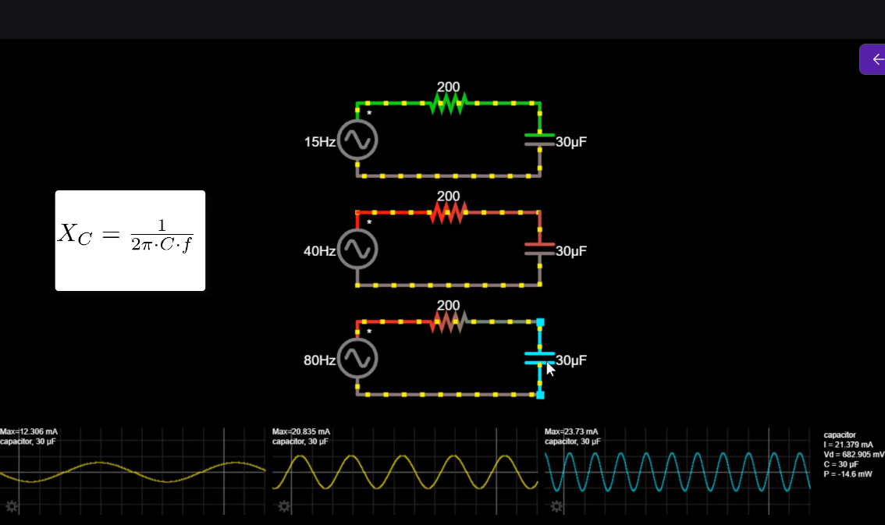

  
На цьому рисунку видно залежність реактивного опору конденсатора від частоти змінного струму. Чим більша частота, тим менший реактивний опір. Чим менша частота, тим менший реактивний опір. Чим менший реактивний опір, тим більший струм.

Реактивний опір — це не “реальний опір”.
Він не розсіює енергію.
Він описує, наскільки елемент **опирається зміні** поля або струму.

Важливо, що на графіку написані **максимальні(пікові)** струми синусоїдальної форми сигналу. В симуляторі можна зробити відображення RMS(root mean square (див. 48.1)) струму.  

## Як обчислити RMS струму?
В усіх графіках, максимальне значення джерел напруги - 5 вольт.  
Середньоквадратичний корінь (RMS) напруги можна обчислити за формулою:  
$$V_{RMS} = \frac{V_{peak}}{\sqrt{2}} = \frac{5}{\sqrt{2}} \approx 3.54 \text{ В}$$
Сила струму знаходиться за наступною формулою:  
$$I = \frac{V_{RMS}}{Z}$$
### Що таке Z?
Імпеданс (
) — це повний комплексний опір електричного кола змінному струму, що враховує як активний опір (
, омічний), так і реактивний опір (
, індуктивний та ємнісний). Вимірюється в Омах (Ω).  
.png>)  
Якщо поставити резистор замість конденсатора, тоді $I_{RMS} = \frac{V_{RMS}}{R_1+R_2}$.  
Якщо в колі стоїть конденсатор, не можна просто скласти резистивний та реактивний опір, тобто ось це: $I_{RMS} = \frac{V_{RMS}}{R_1 + X_C}$ **неправильна** формула.  
Правильно знаходити за формулою, що зображена на рисунку.  
-1.png>)  
Чому так: (див. 48.2)