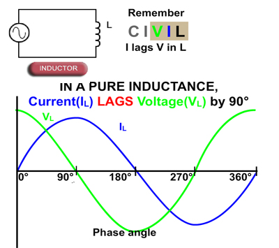

https://www.youtube.com/watch?v=3QtpaICzSNc  

https://youtu.be/3QtpaICzSNc?t=320 - наведена хороша аналогія для заряджання конденсатора - це як накачування повітря в шину. З часом в шині стає більше повітря (напруга на конденсаторі), і збільшується тиск, який все більше чинить опір тиску насоса.  

Ще одне логічне пояснення, чому реактивний опір зменшується зі збільшенням частототи - чим частіша зміна струму, тим менше встигає зарядитися конденсатор протягом однієї зміни струму, тому він чинить менший опір електронам, що на нього приходять.  

https://youtu.be/3QtpaICzSNc?t=658 - наведена хороша аналогія для котушки в колі постійного струму - це як розкручування маховика. На початку його складно розкрутити (котушка чинить великий опір стурму, поки заряджаєтсья), коли маховик розкрутити, він вже не буде чинити опір крутінню(котушка заряджена) але коли він вже розкручений, його складно зупинити (котушка не хоче, щоб струм зупинявся, тому по інерції створює новий струм).  

Також це логічно пояснює, чому індуктивний опір збільшується зі збільшенням частоти - чим частіша зміна струму, тим більше індуктивність намагається протидіяти цій зміні, тому вона чинить більший опір електронам, що на неї приходять. Намагання розкручувати маховик в різні сторони частіше буде складніше, ніж повільніше крутіння в різні сторони. По суті на початку зміни напрямку струму, струм найменший (дорівнює нулю) і при більшій частоті він просто менше розганяється, а тому і має меншу середньоквадратичну величину через реактивний опір. Важливо: це працює тільки для **сталої** напруги.  

$$ X_L = 2\pi f L$$

  
WTF?