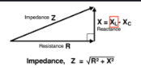

https://www.youtube.com/watch?v=3QtpaICzSNc  

https://youtu.be/3QtpaICzSNc?t=320 - наведена хороша аналогія для заряджання конденсатора - це як накачування повітря в шину. З часом в шині стає більше повітря (напруга на конденсаторі), і збільшується тиск, який все більше чинить опір тиску насоса.  

Ще одне логічне пояснення, чому реактивний опір зменшується зі збільшенням частототи - чим частіша зміна струму, тим менше встигає зарядитися конденсатор протягом однієї зміни струму, тому він чинить менший опір електронам, що на нього приходять.  

https://youtu.be/3QtpaICzSNc?t=658 - наведена хороша аналогія для котушки в колі постійного струму - це як розкручування маховика. На початку його складно розкрутити (котушка чинить великий опір стурму, поки заряджаєтсья), коли маховик розкрутити, він вже не буде чинити опір крутінню(котушка заряджена) але коли він вже розкручений, його складно зупинити (котушка не хоче, щоб струм зупинявся, тому по інерції створює новий струм).  

Також це логічно пояснює, чому індуктивний опір збільшується зі збільшенням частоти - чим частіша зміна струму, тим більше індуктивність намагається протидіяти цій зміні, тому вона чинить більший опір електронам, що на неї приходять. Намагання розкручувати маховик в різні сторони частіше буде складніше, ніж повільніше крутіння в різні сторони. По суті на початку зміни напрямку струму, струм найменший (дорівнює нулю) і при більшій частоті він просто менше розганяється, а тому і має меншу середньоквадратичну величину через реактивний опір. Важливо: це працює тільки для **сталої** напруги.  

$$ X_L = 2\pi f L$$

  
# питання: WTF? А втф, тому що я думав, що на графіку зображено напругу на джерелі живлення. А насправді, це напруга на котушці індуктивності, яка протидіє зміні струму в котушці.  
Ще раз: напруга на котушці індуктивності пропорційна **швидкості зміни** струму в ній.  
Формула: $$V_L = L \frac{dI}{dt}$$
**Важливо**: струмом керує джерело живлення, яке змінює його напрямок в різні сторони.
- від $0 °$ до $90 °$. В момент, коли струм починає зростати, напруга на котушнці індуктивності максимальна (ворот рушає з місця). Рухаючись до $90 °$, швидкість зростання струму сповільнюється, через це падає напруга на котушці індуктивності. До моменту піку струму, коли він не змінюється ($\frac{dI}{dt} = 0$), напруга на котушці індуктивності дорівнює нулю.
- від $90 °$ до $180 °$. В момент, коли струм починає зменшуватися, котушка індуктивності "по інерції" намагається підтримувати струм, тому створює напругу в тому ж напрямку, що і струм. Рухаючись до $180 °$, швидкість зменшення струму збільшується, через це  напруга на котушці індуктивності зростає до свого негативного піку (не важливо, негативний чи позитивний, логіка працює симетрично).
- від $180 °$ до $270 °$. Струм починає збільшуватися, але вже в іншу сторону. З часом швидкість "негативного" зростання струму зменшується і напруга на котушці доходить до нуля в момент піку струму.
- від $270 °$ до $360 °$. Струм починає "негативно" зменшуватися, тому котушка індуктивності знову намагається підтримувати струм, створюючи напругу в тому ж напрямку, що і струм. З часом швидкість "негативного" зменшення струму збільшується, через це  напруга на котушці індуктивності зростає до свого позитивного піку.
- і так по колу.

# Наступне питання: а для графіків конденсатора (пункт 46) показано напругу на джерелі живлення, чи напругу на конденсаторі?
Відповідь: і те і інше, тому що на конденсаторі "накопичується" напруга, яка дорівнює напрузі на джерелі живлення в різні моменти часу.

# імпеданс дорівнює цьому, бо графіки для індуктора та конденсатора перпендикулярні?
  
Так 👍 — саме тому.

Імпеданс дорівнює

$$
Z = \sqrt{R^2 + X^2}
$$

бо активна частина (R) і реактивна частина (X) **перпендикулярні в фазовій (комплексній) площині**.

Але важливо розуміти, що “перпендикулярні” означає не графіки синусів у часі, а фазори.

---

# 1️⃣ Чому вони перпендикулярні?

У змінному струмі:

* У резистора струм і напруга **в фазі**
* У індуктивності струм **відстає на 90°**
* У конденсатора струм **випереджає на 90°**

90° — це і є перпендикулярність у комплексній площині.

---

# 2️⃣ Через комплексні числа

Імпеданс записують так:

$$
Z = R + jX
$$

де:

* (R) — дійсна частина
* (X) — уявна частина
* (j) — поворот на 90°

Модуль комплексного числа:

$$
|Z| = \sqrt{R^2 + X^2}
$$

Це просто теорема Піфагора.

---

# 3️⃣ Геометрична інтуїція

Уяви:

* R — горизонтальна вісь
* X — вертикальна вісь

Тоді повний імпеданс — це гіпотенуза прямокутного трикутника.

Саме тому не можна писати:

$$
Z = R + X
$$

Бо вони не “в один бік”.

---

# 4️⃣ Чому фізично вони під 90°?

Бо:

* Резистор пов’язує напругу зі струмом без зсуву фази.
* Індуктивність/конденсатор пов’язують їх через похідну/інтеграл.

А похідна синуса — це косинус.

А косинус — це синус, зсунений на 90°.

Ось звідки з’являється перпендикулярність.

---

# 5️⃣ Коротко

Так, імпеданс дорівнює кореню з суми квадратів, бо:

* R і X — ортогональні величини
* вони зсунуті по фазі на 90°
* імпеданс — це векторна сума

---

Якщо хочеш, можу показати дуже глибокий момент:

чому множення на (j) математично означає поворот на 90°, і як це напряму пов’язано з похідною синуса 🔥
