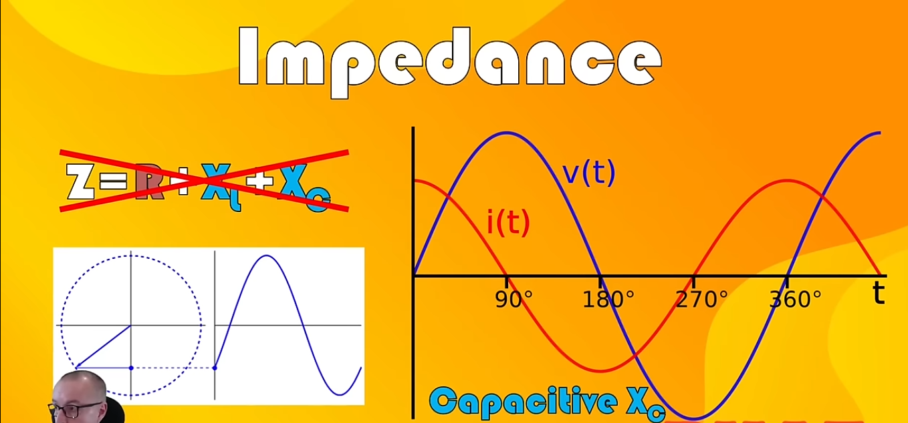
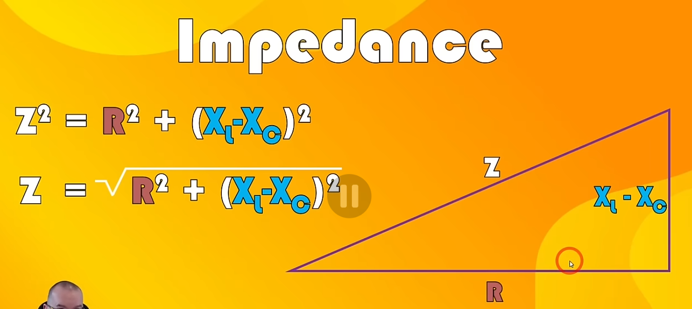
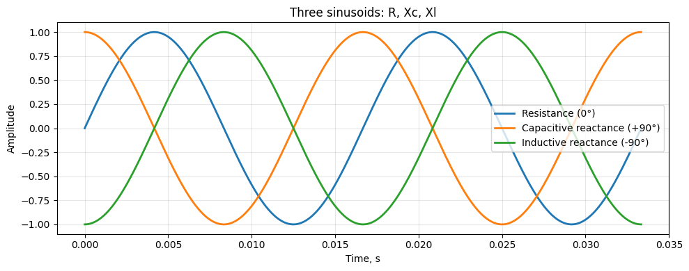

# То звідки береться формула для імпедансу?
$$Z = \sqrt{R^2 + X^2}$$
або
$$Z = \sqrt{R^2 + (X_L-X_C)^2}$$
де
- $R$ - це резистивний опір
- $X_L$ - індуктивний опір
- $X_C$ - ємнісний опір

## Чому ми віднімаємо індуктивний та ємнісний опір? 
Бо вони протидіють один одному. Індуктивний опір намагається підтримувати струм, а ємнісний опір намагається протидіяти струму. Тому вони працюють в різних напрямках, і їх потрібно віднімати один від одного, щоб отримати загальний реактивний опір. На графіку це видно, бо вони зображені в "антифазі" один до одного. Коли індуктивний опір зростає, ємнісний опір зменшується, і навпаки. Це як дві сили, що тягнуть в різні сторони, і щоб знайти результуючу силу, потрібно відняти їх один від одного.  

## Чому імпеданс - це квадратний корінь суми квадратів?
Бо резистивний та реактивний опір не просто складаються, а працюють під кутом 90 градусів одне відносно одного  
  
  
Сумарно три графіки можна зоообразити ось так:  
  
Тут видно, що capacitive reactance та inductive reactance працюють протилежно один до одного (по суті кут 180 градусів). І вони обоє працюють під кутом 90 градусів до резистивного опору. 