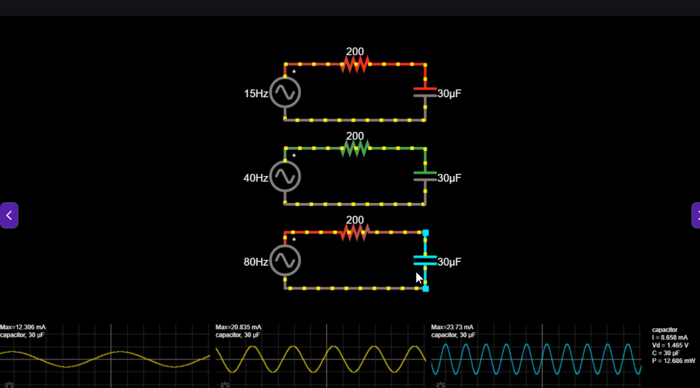

# питання: чому при більшій частоті максимальний струм набільший. Хіба максимальний струм не повинен бути всюди однаковий?
На графіках зображена напруга (не струм), а струм залежить від **швидкості зміни напруги**. Чим більша частота, тим швидше змінюється напруга (похиліші графіки). $X_C = \frac{1}{2\pi f C}$; $i = C \frac{du}{dt}$. Це струм через конденсатор.  
Якщо напруга змінюється швидше, заряд треба перерозподіляти швидше → більший струм. $I = \frac{dQ}{dt}$.  

.png>)  
А тут показано конденсатори з різними ємностями. Чим більша ємність, тим більший заряд може накопичувати конденсатор на своїх пластинах (див [47.2](../47.2%20детальніше%20про%20ємність/summary.md)). 