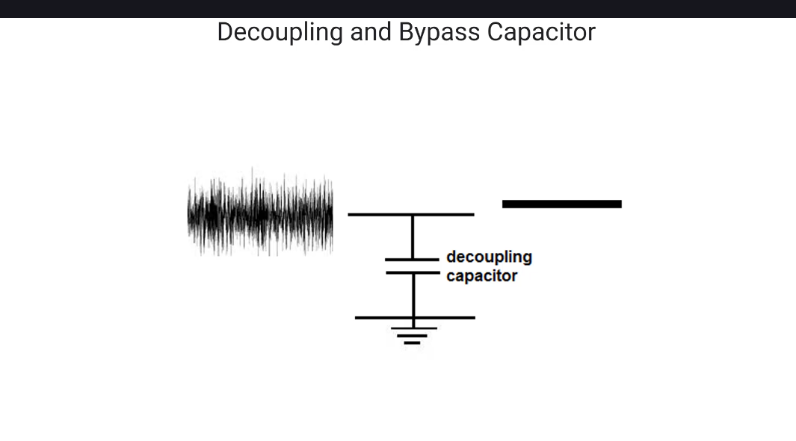
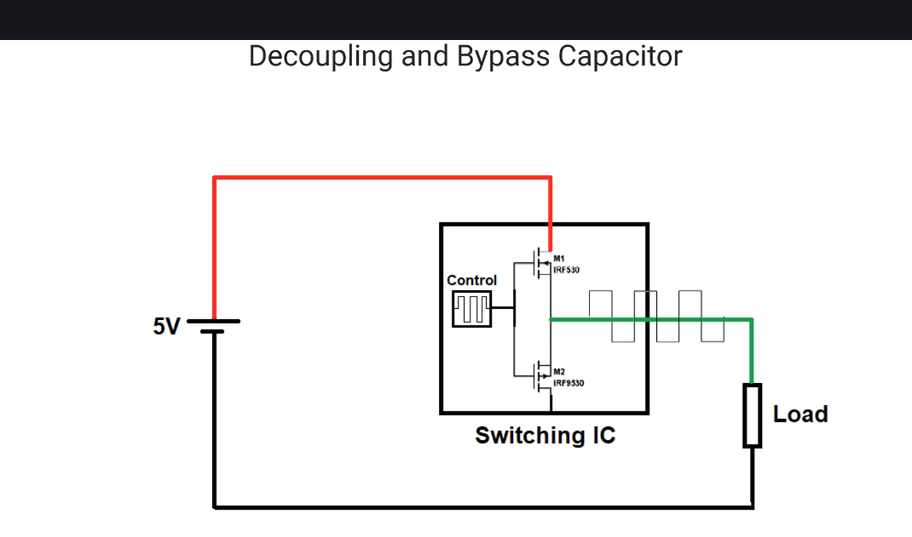
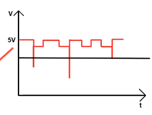

# Decoupling capacitor (Розв’язувальний конденсатор)
В той час, як розділовий конденсатор викристовується щоб пропускати компоненту змінного струму, блокуючи постійний струм. **Розв’язувальний конденсатор** прибирає змінну складову, тим самим робить постійний струм більш чистим (стабільним). Вони часто використовуються там, де треба прибрати шум в джерелі постійного струму.  
  

# Як я це собі уявляю
Конденсатор накопичує на собі заряд, припустимо 5В. Коли на напрузі відбувається коливання (скачок), напруга на конденсаторі "усереднює" ці скачки, через це сигнал стає більш плавним, не стрибкоподібним. Але стрибки все одно відбуваються, просто вони не такі різкі і ними можна знехтувати.  
Як каже чат гіпіті: Конденсатор не стільки усереднює, скільки швидко віддає або приймає струм, щоб утримати напругу стабільною. $I = C \cdot \frac{dV}{dt}$.
- якщо напруга намагається швидко змінитися
- конденсатор пропускає великий струм, щоб цьому завадити.

- якщо напруга падає → струм іде з конденсатора
- якщо напруга росте → струм іде у конденсатор (симетрична логіка, конденсатор по суті приймає удар на себе, бо він уміє заряджатися).

# Більш детально:
<details>
<summary>Показати/Сховати</summary>

## чи правильне моє інтуїтивне уявлення про розв'язувальний конденсатор?
    Конденсатор накопичує на собі заряд, припустимо 5В. Коли на напрузі відбувається коливання (скачок), напруга на конденсаторі "усереднює" ці скачки, через це сигнал стає більш плавним, не стрибкоподібним. Але стрибки все одно відбуваються, просто вони не такі різкі і ними можна знехтувати.

Твоє уявлення **в цілому правильне**, але є кілька важливих уточнень. Ти добре відчуваєш інтуїцію “усереднення”, але розв’язувальний конденсатор працює трохи інакше.

---

# Що ти описав правильно

✔ Конденсатор заряджається до приблизно **5 В**.
✔ Коли напруга на шині живлення змінюється, конденсатор **частково згладжує ці зміни**.
✔ Після цього коливання стають **меншими**.

Це справді відбувається.

---

# Але головна фізика трохи інша

Конденсатор **не стільки усереднює**, скільки **швидко віддає або приймає струм**, щоб утримати напругу стабільною.

Ключова формула:

$
I = C \frac{dV}{dt}
$

Тобто:

* якщо напруга намагається **швидко змінитися**
* конденсатор пропускає **великий струм**, щоб цьому завадити.

---

# Що реально відбувається в схемі

Припустимо, мікроконтролер різко спожив струм.

### Без конденсатора

```
Vcc ──────── IC
```

струм береться через довгі доріжки →
індуктивність і опір →
напруга **просідає**.

---

### З decoupling capacitor

```
Vcc ──────── IC
        │
       C
        │
       GND
```

коли IC різко бере струм:

* конденсатор **миттєво віддає заряд**
* напруга на Vcc **майже не падає**

Потім блок живлення повільніше підзаряджає конденсатор назад.

---

# Інтуїція

Розв’язувальний конденсатор — це як **маленький локальний акумулятор** біля мікросхеми.

Він:

* швидко дає струм
* згладжує пікові навантаження
* не дає напрузі "провалитися".

---

# Чому кажуть "згладжує шум"

Бо високочастотні коливання:

* мають великий (dV/dt)
* тому через конденсатор тече великий струм
* і вони шунтуються на землю.

Тобто він працює як **фільтр високих частот** для шуму.

---

# Найточніша інтуїція

Розв’язувальний конденсатор:

**підтримує стабільну напругу на шині живлення, швидко компенсуючи короткі імпульси струму.**

---

# Маленьке уточнення до твоєї фрази

Ти написав:

> "напруга на конденсаторі усереднює скачки"

Краще сказати:

> конденсатор **перешкоджає швидким змінам напруги**, віддаючи або приймаючи струм.

## я розумію, яким чином він бореться із просадками напруги (коли падає нижче DC напруги). А як це праює зі скачками напруги (коли піднімається вище DC напруги)?
Дуже гарне питання — ти вже зрозумів половину фізики 👍
Механізм для **просадок** і **скачків вгору** насправді **симетричний**.

Розберемо інтуїтивно.

---

# 1️⃣ Початковий стан

Конденсатор заряджений до:

```
5 V
```

тобто:

```
Vcap = 5 V
```

і сидить між **Vcc** і **GND**.

---

# 2️⃣ Якщо напруга різко падає (просадка)

Наприклад:

```
5V → 4.8V
```

Що відбувається:

* конденсатор **вже заряджений до 5V**
* тому він починає **віддавати заряд у шину**

```
конденсатор → схема
```

і напруга не падає так сильно.

---

# 3️⃣ Якщо напруга різко піднімається

Наприклад:

```
5V → 5.2V
```

Тут конденсатор поводиться навпаки.

Його напруга:

```
Vcap = 5V
```

а шина хоче стати **5.2V**.

Тому через конденсатор починає текти струм:

```
шина → конденсатор → земля
```

Тобто він **поглинає заряд**.

---

# 4️⃣ Формально через рівняння

$
I = C \frac{dV}{dt}
$

* якщо напруга **росте** → струм іде **у конденсатор**
* якщо напруга **падає** → струм іде **з конденсатора**

---

# 5️⃣ Інтуїція

Конденсатор — це елемент, який **не любить зміну напруги**.

Він завжди намагається:

```
V(t) ≈ const
```

Тому:

| що відбувається | реакція конденсатора |
| --------------- | -------------------- |
| напруга падає   | віддає заряд         |
| напруга росте   | поглинає заряд       |

---

# 6️⃣ Дуже корисна аналогія

Уяви **бак з водою**, підключений до труби.

Якщо тиск у трубі:

* падає → бак віддає воду
* росте → бак забирає воду

Тому тиск у трубі стає більш стабільним.

---

# 7️⃣ Чому це працює особливо добре для шуму

Бо шум — це **швидкі зміни напруги**.

А конденсатор добре реагує саме на:

$
\frac{dV}{dt}
$

тобто швидкі коливання.

---

# Коротко

Розв’язувальний конденсатор:

* **віддає заряд**, коли напруга падає
* **забирає заряд**, коли напруга росте

Тому він **згладжує і провали, і піки**.

---
</details>

# що таке шунтувальний (bypass) конденсатор?
Розглянемо приклад:
   
**Control** генерує квадратний сигнал, який іде на **Load**. В ідеальному світі дроти та джерело напруги не мають індуктивності, і в ідеальному світі нам не потрібні шунтувальні конденсатори. Напруга, що йде на IC буде ідеально стабільною.   

Але в реальному світі дроти мають індуктивність, і коли струм різко змінюється (control чергує сигнал між HIGH та LOW з певною частотою), це викликає коливання напруги на дротах. По суті дроти працюють як котушки індуктивності, для них теж працює закон Фарадея.  
.png>)  
Інколи ці стрибки можуть просідати нижче робочої напруги мікросхеми (IC) і це спричиняє дивну поведінку.  


# чат гіпіті:
<details>
<summary>Показати відповідь</summary>

На цій схемі показано **навіщо потрібен decoupling/bypass конденсатор біля мікросхеми, яка швидко перемикає струм**. Розберемо по кроках.

---

## 1. Що робить Switching IC

Мікросхема всередині має транзистори (MOSFET), які **дуже швидко вмикають і вимикають струм** через навантаження.

Тобто струм виглядає приблизно так:

```
I(t)
│  ▇▁▇▁▇▁▇▁▇
└─────────── t
```

Кожне перемикання означає **раптову зміну струму**.

---

## 2. Проблема без конденсатора

Живлення приходить по доріжках плати або проводах.
У них є **індуктивність і опір**.

Коли струм різко змінюється:

$
V = L \frac{dI}{dt}
$

виникає **стрибок напруги на живленні**.

Тобто замість рівних 5 V отримуємо:

```
5V ──╲╱╲╱╲╱
```

Це може викликати:

* збої мікросхеми
* шум
* EMI
* перезапуски MCU

---

## 3. Що робить decoupling capacitor

Конденсатор ставлять **дуже близько до ніжок живлення IC**.

```
5V ──── IC
      │
      C
      │
     GND
```

Він працює як **локальне джерело енергії**.

---

## 4. Коли IC різко бере струм

Коли транзистор включається:

```
IC потребує струм
```

замість того щоб тягнути його через довгі доріжки,

струм приходить так:

```
конденсатор → IC
```

Це дуже короткий шлях.

---

## 5. Потім конденсатор перезаряджається

Після імпульсу:

```
джерело 5V → заряджає конденсатор назад
```

але це відбувається **повільніше**, без різких скачків.

---

## 6. Якщо напруга раптом підскочила

Конденсатор робить і зворотне:

```
надлишковий заряд → конденсатор → земля
```

тобто він **гасить піки напруги**.

---

## 7. Чому його ставлять максимально близько

Бо навіть **1–2 см доріжки мають індуктивність**.

Якщо конденсатор далеко — він не встигає віддати струм.

---

## 8. Чому часто ставлять два конденсатори

Зазвичай:

```
100 nF  +  10 µF
```

бо:

| Конденсатор | що гасить              |
| ----------- | ---------------------- |
| 100 nF      | дуже швидкий шум (MHz) |
| 10 µF       | повільні просадки      |

---

## Коротка інтуїція

Decoupling capacitor — це **маленький локальний акумулятор біля мікросхеми**, який:

* швидко віддає струм
* поглинає піки напруги
* ізолює мікросхему від шумів у живленні.

---

Якщо хочеш, можу показати **чому навіть 1 см доріжки може зіпсувати роботу decoupling capacitor** — це дуже цікава фізика індуктивності доріжок.

# а чому змінюється струм? Схема ж все одно живиться від 5 вольт

Це дуже хороше питання, і саме тут багато людей плутаються. Ключова річ: **5 В означає фіксовану напругу, але не фіксований струм.** Струм завжди визначається **навантаженням**, а не джерелом.

---

# 1️⃣ Джерело задає напругу, а не струм

У більшості схем живлення — це **джерело напруги**.

Тобто воно каже:

```
V ≈ 5V
```

А струм визначається законом Ома:

$
I = \frac{V}{R}
$

або взагалі поведінкою всієї схеми.

---

# 2️⃣ Навантаження постійно змінює струм

Візьмемо простий приклад — мікросхема, яка перемикає транзистор.

Коли транзистор **вимкнений**:

```
I ≈ 0
```

Коли **увімкнений**:

```
I ≈ V/R
```

Наприклад:

```
5V / 5Ω = 1A
```

Отже струм стрибає:

```
0A → 1A → 0A → 1A
```

---

# 3️⃣ Це відбувається дуже швидко

У цифрових схемах перемикання може бути:

```
1–10 ns
```

Тобто:

```
dI/dt ≈ 1A / 1ns
```

Це величезна швидкість зміни струму.

---

# 4️⃣ Чому це створює проблему

Тепер у ланцюгу є **індуктивність доріжки**:

```
5V ─── Ltrace ─── IC
```

Для індуктивності:

$
V = L \frac{dI}{dt}
$

Якщо:

```
L = 10 nH
dI/dt = 1A / 1ns
```

то:

$
V = 10,nH \cdot \frac{1A}{1ns} = 10mV
$

І це тільки від маленької доріжки.

У реальних схемах може бути **100–300 мВ шуму**.

---

# 5️⃣ Важлива інтуїція

Напруга 5 В **не означає**, що струм однаковий.

Навпаки:

```
струм = реакція схеми
```

Схема постійно:

```
бере струм → перестає брати → бере знову
```

І саме **ці імпульси струму** викликають проблеми.

---

# 6️⃣ Чому допомагає конденсатор

Без конденсатора струм іде так:

```
5V source → довга доріжка → IC
```

З конденсатором:

```
конденсатор → IC
```

Тобто струм для швидких імпульсів **не йде через індуктивність доріжки**.

---

# 7️⃣ Найкоротше пояснення

Ти інтуїтивно думаєш так:

```
5V → струм сталий
```

А реально:

```
5V → струм визначає навантаження
```

І навантаження (мікросхеми) **постійно різко змінюють струм**.

---


</details>

Тобто по суті ми конденсатором боремося з індуктивністю (у них графіки протидіють одне одному, "тягнуть в різні сторони").
