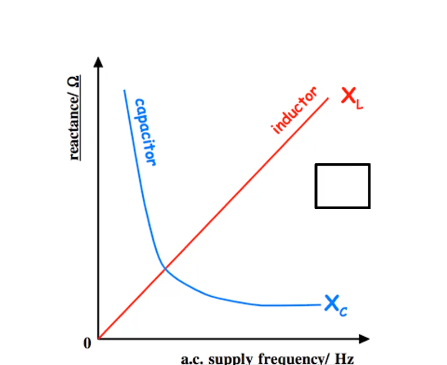
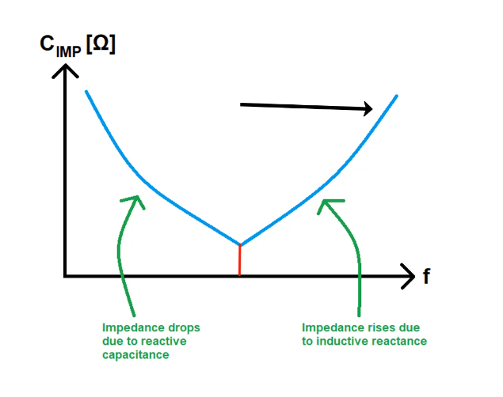
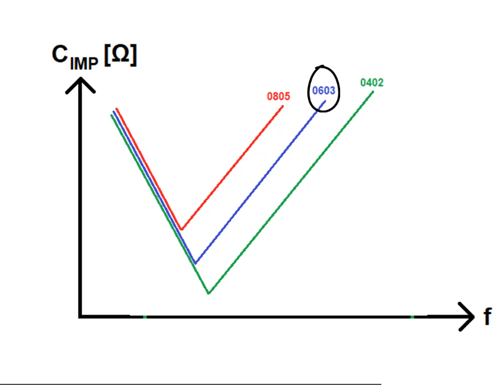

# Чому ми повинні розміщувати кілька шунтувальних конденсаторів паралельно для живлення мікросхем?
.png>)  

Почати треба з того, що не існує ідеальних конденсаторів. У реальному світі конденсатори мають певний опір і індуктивність, які можуть впливати на їхню ефективність при фільтрації шуму. На рисунку зображено еквівалентну схему реального конденсатора, яка включає в себе резистор (ESR, equivalent series resistance) і індуктивність (ESL, equivalent series inductance).  

-1.png>)  

Формули для обчислення реактивного опору конденсатора ($X_C$) і індуктивного опору ($X_L$):
$$X_C = \frac{1}{2\pi f C}$$
$$X_L = 2\pi f L$$

індуктивний опір зростає з частотою, тоді як реактивний опір конденсатора зменшується.  


На рисунку знизу показано, яким чином ESL впливає на загальний імпеданс конденсатора. Зі збільшенням частоти (горизонтальна вісь) імпеданс конденсатора спочатку зменшується, доходить до точки мінімуму, вона ще називається **резонансною частотою** ($f_0$), а потім починає зростати через домінування індуктивного опору. Тобто на високих частотах конденсатор **певної ємності** починає працювати як індуктивність, а не як конденсатор.  
Тобто конденсатор вже не може швидко розряджатися і заряджатися для компенсації індуктивності дротів (див. 51).(Його внутрішні дроти самі не встигають достатньо швидко заряджатися енергією, щоб швидко створювати магнітне поле та не встигають достатньо швидко розряджатися, щоб це поле зникало не створюючи інерцію (див 48.2)).  
  

# Чат гіпіті
<details>
<summary>Показати/Сховати</summary>

# нащо тоді ставити декілька конденсаторів, а не поставити один з великою ємністю, який би впорався з усіма частотами?
Коротко: **один великий конденсатор не працює добре на всіх частотах**, бо реальний конденсатор має **ESR і ESL**, і через це його імпеданс має **мінімум тільки в певному діапазоні частот**. Тому ставлять **кілька конденсаторів різних номіналів**, щоб покрити широкий спектр шуму.

Розберемо інтуїтивно.

---

## 1️⃣ Імпеданс реального конденсатора

Модуль імпедансу:

$
|Z|=\sqrt{R_{ESR}^2+\left(\omega L_{ESL}-\frac{1}{\omega C}\right)^2}
$

Тому графік виглядає приблизно так:

```
|Z|
│\
│ \
│  \        /
│   \______/ 
│
└────────────── f
        f₀
```

* зліва — **ємнісна область**
* мінімум — **резонанс**
* справа — **індуктивна область**

---

## 2️⃣ Великий конденсатор має низьку резонансну частоту

Наприклад:

| Конденсатор | резонанс         |
| ----------- | ---------------- |
| 10 µF       | ~100 kHz – 1 MHz |
| 100 nF      | ~10–30 MHz       |
| 1 nF        | ~100 MHz         |

Тобто великий конденсатор **перестає працювати як конденсатор** на високих частотах.

---

## 3️⃣ Джерела шуму в схемі

У цифровій електроніці шум має **дуже широкий спектр частот**:

```
1 kHz  → 1 MHz → 100 MHz → GHz
```

Наприклад:

* повільні зміни навантаження → kHz
* перемикання логіки → MHz
* фронти сигналів → десятки MHz

---

## 4️⃣ Один великий конденсатор не покриє весь спектр

Наприклад:

```
10 µF
```

добре працює тут:

```
10 kHz – 200 kHz
```

але на 50 MHz він вже поводиться **як індуктивність**.

---

## 5️⃣ Тому ставлять кілька конденсаторів

Типовий набір:

```
10 µF
1 µF
100 nF
```

Їх імпеданси перекривають один одного.

Графік виглядає так:

```
|Z|
│\       /\ 
│ \_____/  \_____
│
└──────────────── f
```

У результаті **загальний імпеданс живлення стає низьким у широкому діапазоні частот**.

---

## 6️⃣ Ще одна причина — ESL

Великі конденсатори мають:

* довші виводи
* більшу внутрішню індуктивність

Тому вони гірше працюють на високих частотах.

Маленькі керамічні конденсатори:

```
0402 / 0603
```

мають дуже малий **ESL**, тому добре гасять **швидкі імпульси струму**.

---

## 7️⃣ Інтуїція

Можна уявити це так:

* **великий конденсатор** → повільний резерв енергії
* **малий конденсатор** → швидкий локальний буфер

---

## Висновок

Ставлять кілька конденсаторів, бо:

1. кожен має **резонанс у різному діапазоні частот**
2. великий конденсатор **не працює на високих частотах**
3. маленькі мають **менший ESL**
4. разом вони **зменшують імпеданс живлення у широкому спектрі частот**

---

# добре, перефразую, чому не ставити конденсатори з найбільшим резонансом? хіба він не підійде для будь якої частоти?

Дуже гарне питання — тут є тонка, але важлива річ:
**конденсатор з високою резонансною частотою не працює добре на низьких частотах.**

Тобто **немає одного конденсатора, який має низький імпеданс у всьому діапазоні частот.**

Розберемо чому.

---

## 1️⃣ Що означає “висока резонансна частота”

Резонанс:

$
f_0=\frac{1}{2\pi\sqrt{LC}}
$

Щоб (f_0) була **високою**, потрібно:

* **маленька ємність**
* **малий ESL**

Наприклад:

| C      | резонанс         |
| ------ | ---------------- |
| 1 nF   | ~100–300 MHz     |
| 100 nF | ~10–30 MHz       |
| 10 µF  | ~100 kHz – 1 MHz |

---

## 2️⃣ Що відбувається на низьких частотах

Реактивний опір конденсатора:

$
X_C=\frac{1}{2\pi f C}
$

Якщо (C) маленька, то на низьких частотах:

$
X_C
$

стає **великим**.

Наприклад:

### 1 nF конденсатор

на 10 kHz:

$
X_C \approx 16k\Omega
$

тобто він **майже не працює** як decoupling.

---

## 3️⃣ А великий конденсатор

Наприклад **10 µF**:

на 10 kHz:

$
X_C \approx 1.6\Omega
$

він **дуже добре тримає повільні зміни струму**.

---

## 4️⃣ Тому різні конденсатори працюють у різних діапазонах

| Конденсатор | що гасить             |
| ----------- | --------------------- |
| 10–100 µF   | повільні зміни струму |
| 1 µF        | середні частоти       |
| 100 nF      | швидкі імпульси       |
| 1–10 nF     | дуже швидкий шум      |

---

## 5️⃣ Як виглядає сумарний імпеданс

Якщо поставити один:

```id="x7dx8u"
|Z|
│\
│ \
│  \____
│
└──────── f
```

Якщо кілька:

```id="19mrxp"
|Z|
│\    /\    /\ 
│ \__/  \__/  \__
│
└────────────── f
```

У результаті імпеданс **низький у широкому діапазоні частот**.

---

## 6️⃣ Інтуїція

Можна уявити так:

* **великий конденсатор** — повільний “резервуар енергії”
* **малий конденсатор** — швидкий “шок-абсорбер”

Разом вони працюють краще.

---

## Висновок

Не можна ставити тільки конденсатор з високим резонансом, тому що:

* він має **маленьку ємність**
* на низьких частотах його імпеданс **занадто великий**
* він не може компенсувати **повільні зміни струму**

Тому використовують **набір конденсаторів різних номіналів**.

---

💡 Є ще одна дуже цікава причина, про яку рідко пишуть у підручниках:
**декілька конденсаторів можуть створювати антирезонанс і навіть погіршити живлення**, якщо їх підібрати неправильно. Це дуже важлива тема в PDN design.

# Я все одно не можу зрозуміти, чому конденсатори маленької ємності не здатні справлятися з низькими частотами. Як це можна інтуїтивно зрозуміти? В моєму розумінні конденсатор заряджається та розряджається для стабілізації живлення. А яка різниця чи ривки живлення відбуваються швидко чи повільніше. Чому повільне заряджання/розряджання непосильне для маленьких конденсаторів? З великими зрозуміло, в них висока індуктивність і вони не можуть швидко розряджатися/заряджатися, але чому маленькі не можуть робити це повільно?

Ти дуже близько до правильного розуміння. Ключова річ, яка тут заважає інтуїції: **конденсатор стабілізує напругу не “фактом заряджання”, а кількістю заряду, який він може віддати або прийняти**. А ця кількість напряму залежить від ємності.

Давай розкладу це інтуїтивно.

---

## 1️⃣ Що насправді робить decoupling конденсатор

Коли мікросхема різко бере струм, вона фактично **витягує заряд із живлення**.

Конденсатор повинен **віддати цей заряд**, щоб напруга не впала.

Формула:

$
Q = C V
$

і

$
\Delta V = \frac{\Delta Q}{C}
$

---

## 2️⃣ Ключовий момент

Якщо конденсатор маленький, то **невелике вилучення заряду викликає великий спад напруги**.

Наприклад.

Мікросхема взяла:

```id="d1"
ΔQ = 1 nC
```

### Конденсатор 1 nF

$
\Delta V = \frac{1nC}{1nF} = 1V
$

Напруга просіла на **1 В**.

---

### Конденсатор 10 µF

$
\Delta V = \frac{1nC}{10µF} = 0.0001V
$

Просадка лише **0.1 мВ**.

---

## 3️⃣ Інтуїція через воду

Уяви резервуар з водою.

### Маленька ємність

```id="d2"
маленька чашка
```

Якщо забрати трохи води — рівень одразу сильно падає.

---

### Велика ємність

```id="d3"
великий бак
```

Якщо забрати ту саму кількість води — рівень майже не зміниться.

---

## 4️⃣ Тепер про частоту

Низька частота означає:

```id="d4"
струм тече довше
```

Тобто потрібно **більше заряду**.

А маленький конденсатор **просто не має достатнього запасу заряду**.

---

## 5️⃣ Висока частота

При дуже швидкому імпульсі:

```id="d5"
струм короткий
```

Потрібно **мало заряду**, але **дуже швидко**.

Маленький конденсатор:

* має малий ESL
* може швидко реагувати

тому він добре працює тут.

---

## 6️⃣ Тому і ставлять кілька

| конденсатор | що робить             |
| ----------- | --------------------- |
| 10–100 µF   | тримає повільні зміни |
| 1 µF        | середні               |
| 100 nF      | швидкі                |
| 1–10 nF     | дуже швидкі           |

---

## 7️⃣ Коротка інтуїція

Маленький конденсатор **може реагувати повільно**, але:

**в ньому просто замало заряду**, щоб довго підтримувати напругу.

---

## 8️⃣ Найкоротша формула інтуїції

Якщо схема бере струм (I) протягом часу (t):

$
\Delta V = \frac{I \cdot t}{C}
$

Видно:

* більший час (низька частота)
* менший (C)

→ **великий спад напруги**

---

✅ Тобто проблема **не в швидкості заряджання**, а в **запасі заряду**.

---


# Тобто повільніші просадки потребують більшого заряду для стабілізації більших gap між скачками. А маленький конденсатор занадто швидко розряджається щоб на цей gap вистачило заряду, щоб його вирівняти?
Ти **майже ідеально сформулював ідею**, тільки одну річ варто трохи уточнити.

Твоя фраза:

> маленький конденсатор занадто швидко розряджається

фізично трохи неточна. Краще сказати:

> **у маленькому конденсаторі просто мало заряду**, тому він швидко втрачає напругу.

Розберемо інтуїтивно.

---

## 1️⃣ Що насправді відбувається

Коли мікросхема бере струм (I) протягом часу (t), вона забирає заряд:

$
Q = I \cdot t
$

Конденсатор має заряд:

$
Q = C \cdot V
$

Коли цей заряд зменшується, напруга падає:

$
\Delta V = \frac{I \cdot t}{C}
$

---

## 2️⃣ Чому повільні просадки гірші для маленького конденсатора

Повільні зміни означають:

```id="a1"
t велике
```

Тобто потрібно віддати **більше заряду**.

А якщо (C) маленьке, то:

```id="a2"
ΔV стає великим
```

Тобто напруга сильно просідає.

---

## 3️⃣ Інтуїція через резервуар води

### Маленький конденсатор

```id="a3"
маленька склянка
```

Вода витікає трохи довше → рівень падає майже до нуля.

---

### Великий конденсатор

```id="a4"
великий бак
```

Та сама витрата води → рівень майже не змінюється.

---

## 4️⃣ А чому маленькі конденсатори хороші на високих частотах

Бо імпульси струму дуже короткі:

```id="a5"
t маленьке
```

Потрібно віддати **мало заряду**.

Тут головне — **швидкість**, а не запас енергії.

---

## 5️⃣ Тому і ставлять кілька

| конденсатор | роль                 |
| ----------- | -------------------- |
| 10–100 µF   | великий запас заряду |
| 1 µF        | середні зміни        |
| 100 nF      | швидкі імпульси      |
| 1–10 nF     | дуже швидкі фронти   |

---

## ✔ Твоя ідея перефразована точно

Можна сказати так:

> Повільні зміни навантаження тривають довше, тому потребують більшого запасу заряду для стабілізації напруги. Маленький конденсатор має занадто малу ємність, тому його заряд швидко вичерпується і він не може довго підтримувати напругу.

---

💡 Є ще одна інтуїція, яка **дуже допомагає зрозуміти всю тему decoupling**:
чому інженери часто кажуть, що конденсатор — це **локальне джерело струму для IC**. Це дуже сильно спрощує розуміння.

</details>


# Висновок
Конденсатори з більшою ємністю (більші конденсатори) гасять шуми з низькими частотами, бо на стабілізацію довшої в часі просадки треба більше енергії, а конденсатори з більшою ємністю мають більшу ємність для збереження більшої кількості енергії (зарядів).  
Конденсатори з меншою ємністю (менші конденсатори) гасять шуми з високими частотами, бо вони мають меншу індуктивність (менша обмотка, менше металу, а отже менше індуктивності) і можуть швидше заряджатися і розряджатися для компенсації індуктивності дротів. Якщо конденсатор має велику індуктивність, він не може гасити шуми високої частоти, бо він по суті не встигає швидко заряджатися і розряджатися (велика "інерція").


# Продовження
Зазвичай чим більша форма конденсатора (package), тим більша його індуктивність.  
. Тобто для компенсації високих частот краще брати конденсатори з маленькою формою (наприклад 0402 або 0603), бо вони мають меншу індуктивність і можуть швидко реагувати на зміни струму.

На малюнку показано графіки імпедансу конденсаторів різної ємності, тут видно, що конденсатори з більшою ємністю мають резонанс на нижчих частотах, а конденсатори з меншою ємністю мають резонанс на вищих частотах. Тому для ефективного гасіння шуму в широкому діапазоні частот використовують кілька конденсаторів різної ємності, які доповнюють один одного.  
.png>)  

Якщо скласти графіки, крива набуде наступного вигляду:  
.png>)  
