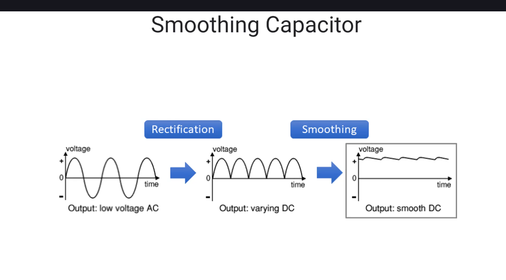

# Smoothing capacitors (згладжувальні конденсатори)
  
Згладжувальні конденсатори використовуються в схемах живлення, в яких змінний струм конвертується в постійний. Без конденсаторів не можливо перетворити змінний струм в постійний.  
