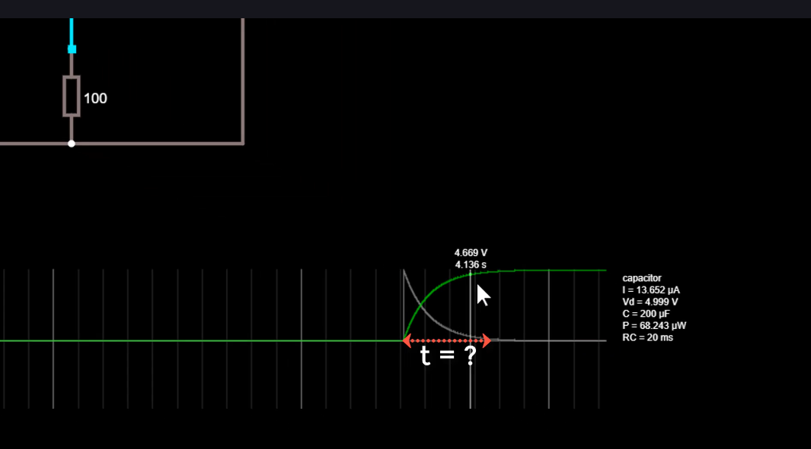

  
Зарядка кожного конденсатора відбувається протягом певного часу $t$.  
.png>)  
Час зарядки залежить не тільки від самого конденсатора, але і від резистора, який увімкнено послідовно з конденсатором.  

**RC-часова константа** (RC time constant) - це час, за який конденсатор заряджається до 63% від своєї максимальної напруги.  

.png>)   
На графіку видно, що після одного RC-часу конденсатор заряджається до 63% від максимальної напруги. Після п'яти RC-часів він заряджається до 99% від максимальної напруги.

**Мій висновок**: конденсатор заряджається швидше, якщо конденсатор має меншу ємність, бо чим більша ємність, тим більше він може вмістити в себе заряду, і тим довше він буде заряджатися при однаковій напрузі. Також конденсатор заряджається швидше, якщо резистор має менший опір, бо при меншому опорі струм може протікати швидше, що дозволяє конденсатору заряджатися швидше.

.png>)  
Якщо замість 10V поставити землю, конденсатор почне розряджатися, і він розрядиться до 37% від максимальної напруги за один RC-час. Після п'яти RC-часів він розрядиться до 1% від максимальної напруги.  

**Мій висновок**: на початку розрядки конденсатор менш охоче віддає заряд, бо пластини конденсатора краще тримають одне одного, бо на них максимальний заряд. Але чим більше конденсатор розряджається, тим легше йому віддавати заряд, бо на пластинах вже менший заряд, і вони не так сильно тримають одне одного.  

# Питання яке виникло: чому час зарядки не залежить від напруги, яка прикладена до конденсатора?
Бо RC - це відносна величина, яка показує, скільки часу потрібно для зарядки конденсатора до певного відсотка від **максимальної** напруги, незалежно від того, яка ця максимальна напруга.  
## чат жіпіті:  
<details>
<summary>Пояснення від ChatGPT</summary>
## Коротка відповідь

Тому що **RC-константа визначається тільки властивостями елементів** (R і C), а не тим, *яка саме напруга подана*. Напруга впливає на **масштаб**, але не на **швидкість процесу**.

---

## 1️⃣ Формула процесу

Для заряджання конденсатора:

$
V(t) = V_0 \left(1 - e^{-t/RC}\right)
$

Для розряджання:

$
V(t) = V_0 e^{-t/RC}
$

Тут:

* (RC) — **часова константа**
* (V_0) — прикладена напруга

👉 Бачиш: (RC) стоїть у показнику експоненти, а (V_0) — просто множник.

---

## 2️⃣ Що означає часова константа

$
\tau = RC
$

Це час, за який:

* заряджання: досягається ~63% від кінцевої напруги
* розряджання: падає до ~37%

Це **відносний процес**, а не абсолютний.

---

## 3️⃣ Інтуїція

Уяви:

* R — це “вузькість труби”
* C — це “об’єм бака”

Тоді:

* (RC) — це **наскільки швидко наповнюється бак**
* (V) — це **висота рівня води, до якого треба дійти**

---

### Якщо напруга більша

```id="b1"
вода піднімається вище
```

але:

* швидкість заповнення визначається тією ж трубою і баком
* форма кривої така сама, просто “вища”

---

## 4️⃣ Через диференціальне рівняння

Основне рівняння:

$
C \frac{dV}{dt} = \frac{V_{in} - V}{R}
$

Перепишемо:

$
\frac{dV}{dt} = \frac{1}{RC}(V_{in} - V)
$

👉 Коефіцієнт перед похідною:

$
\frac{1}{RC}
$

І саме він визначає швидкість зміни.

**Немає залежності від амплітуди напруги.**

---

## 5️⃣ Що змінює напруга

Якщо збільшити (V_{in}):

* струм буде більший
* заряд більший
* кінцева напруга більша

але:

* **відносна швидкість наближення не зміниться**

---

## 6️⃣ Дуже коротко

* (RC) — це “інерція системи”
* напруга — це “наскільки далеко треба дійти”

---

## ✔ Висновок

Часова константа не залежить від напруги, бо:

* вона визначається тільки **R і C**
* описує **форму і швидкість експоненційного процесу**
* напруга лише масштабує результат, але не змінює динаміку

---

💡 Якщо хочеш, можу показати дуже наочний графік:
дві криві для 1V і 10V — вони різні по висоті, але **ідентичні за формою**.
</details>

Так, можу 👍

Буду оформлювати формули через `$...$` (inline) або `$$...$$` (окремим блоком), наприклад:

Inline:
`$V(t) = V_0 \left(1 - e^{-t/RC}\right)$`

Окремо:
$$
V(t) = V_0 \left(1 - e^{-t/RC}\right)
$$

Якщо хочеш ще якісь нюанси форматування (наприклад, вирівнювання або стиль), скажи — підлаштуюсь.
