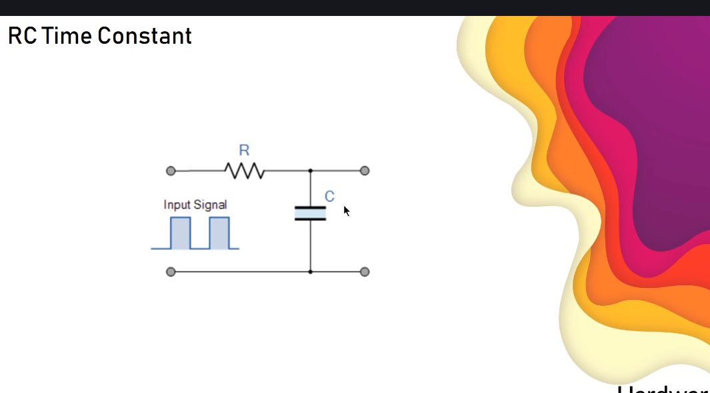
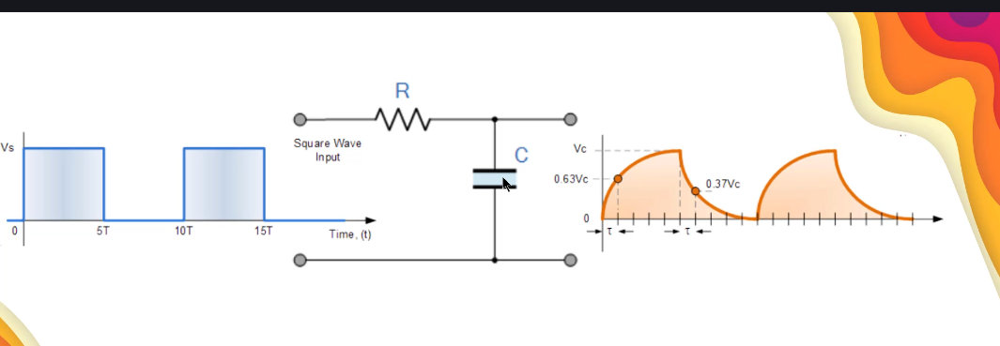
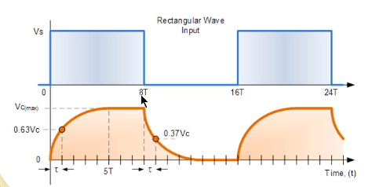
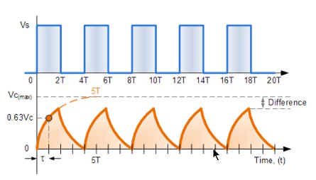
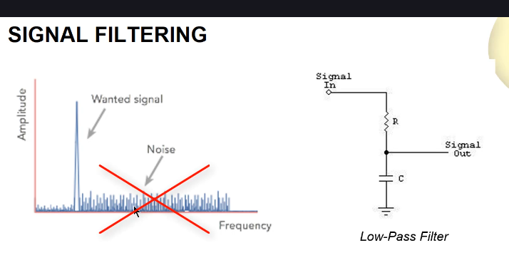

  
Якщо ми будемо подавати на RC коло пульсуючий сигнал з певним періодом, то яким чином це вплине на графік RC?

Якщо ми беремо пульсуючий сигнал з періодом в 5 RC-часових констант, графік буде виглядати наступним чином:  
  

Якщо, наприклад, збільшити цей період до 8 RC-часових констант, то графік буде виглядати наступним чином:  
  

Якщо період зменшити до 2 RC-часових констант, то графік буде виглядати наступним чином:  
  
Питання: чому напруга іде в нуль, якщо період пульсуючого сигналу менший за 5 RC-часових констант? Бо коли напруга висока протягом періоду 2T, конденсатор заряджається не повністю, і тоді, коли він розряджається протягом періоду 2T, він розряджається до нуля, бо він розряджається протягом такого ж періоду часу, що і заряджається.

В симуляторі це виглядає так:  
.png>)  
Тут видно, що максимальна напруга на резисторі не перевищує ~2.7V, в той час, як максимальна напруга на джерелі квадратного сигналу становить 5V.  

## Фільтрація сигналів
RC-кола можна використовувати для відсіювання певних діапазонів частот в сигналах. Наприклад, якщо ми хочемо відсікти високі частоти, ми можемо використовувати RC коло як низькочастотний фільтр(low-pass filter).  
  
Тут видно, що RC-коло з певною RC-часовою константою дозволяє проходити низьким частотам, але відсікає високі частоти. Чим менше RC-часова константа, тим більше високих частот буде проходити через фільтр. Чим більше RC-часова константа, тим більше низьких частот буде проходити через фільтр.

### Інтуїція (про конденсатори, не про RC-кола)
Важливо  (див. 8.52) : більші конденсатори(високої ємності) **не пропускають низькі частоти, бо можуть накопичувати більше енергії, ніж малі, а тому можуть компенсувати більші "провали енергії", властиві для низьких частот. Зате пропускають високі, бо мають високу інертність(індуктивність), і не здатні достатньо швидко реагувати на швидкі коливання**. Для менших конденсаторів (меншої ємності) все навпаки: **мають низьку інертність (індуктивність) для компенсації високих, але також накопичують менше енергії, тому не можуть компенсувати більші "провали енергії" властиві для низьких частот**.  
  

~~Проведемо мисленний експеремент опираючись на цей графік:
візьмемо конденсатор великої ємності, настільки великої, що він **не** пропускає лише декілька низьких частот зліва від певної частоти $f_0$ з самої лівої частини графіка (компенсує їх). Всі інші частоти після частоти $f_0$ (справа від неї) проходять через цей конденсатор, бо він занадто інертний, щоб мати змогу їх компенсувати. Тепер починаємо зменшувати ємність конденсатора. Куди буде рухатися ця частота $f_0$? Вона буде рухатися **вправо**. Коли ми зменшуємо ємність
Тобто на останньому графіку ми використовуємо "малий конденсатор", який пропускає нижчі частоти, але відфільтровує високі.
Роздумуємо наступним чином: треба розглядати випадок для сталої частоти $f$ і для змінної ємності конденсатора, тоді ми зможемо зрозуміти, яким чином вона відфільтровується чи пропускаєтсья. Нехай для конденсатора з ємністю $C_1$ частота $f$ пропускається, тобто він достатньо "інертний", тобто він її не поглинає. Щоб він її поглинав, необхідно зробити його менш інертним, щоб частота поглиналась, тобто відфільтровувалась, для цього ми беремо конденсатор з ємністю $C_2$, яка менше за $C_1$. Таким чином цей новий конденсатор буде пропускати частоту $f$. 
Конденсатор більшої ємності більш інертний, але має більше енергії~~

Це все факінг булщет. Одного конденсатора не вистачить, щоб заблочити широкий діапазон частот. Один конденсатор добре фільтрує тільки невеликий діапазон. Мисленний експеремент: Підбираємо конденсатор, який дуже добре блокує якусь частоту(наприклад *wanted signal*). Цей конденсатор **одночасно** має достатньо низьку інерцію (індуктивність), щоб фільтрувати цей сигнал (його "високочастотну сутність"), а також має достатньо енергії, щоб фільтрувати цей же сигнал (його "низькочастотну сутність").  Але якщо іди наліво по графіку від його ідеальої частоти (брати нижчі частоти за ту, яку він блокує ідеально), цей конденсатор вже не буде годиться (недостатньо добре гаситиме прогалини). Точно так само якщо іти направо по графіку від його ідеальої частоти (брати вищі частоти за ту, яку він блокує ідеально), цей конденсатор вже не буде годиться (він буде занадто індуктивним для цих частот).

## Далі буде
Тому для відсікання більш широкого діапазону використовують не просто конденсатори, а RC-кола. Але про це пізніше (див. 14.91).

