# Урок 270. Магнітне поле і його характеристики

## Дослід Ерстеда  
  
1820 рік Х. Ерстед.  

Виявив, що при протіканні струму в провіднику, який розташований поблизу компаса, голка компаса відхиляється. Це означає, що навколо провідника з струмом існує магнітне поле.  
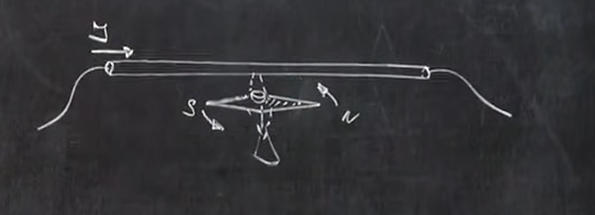  
Північна стрілка компаса відхиляється в напрямку протилежному руху струму.  

Якщо заряд нерухомий, навколо нього створюється електричне поле. Якщо заряд рухається, він створює навколо себе магнітне поле.  

**Магнітне поле** - це особливий вид матерії, що виникає навколо *рухомих* електричних зарядів.  

## Дослід з двома паралельними провідниками із струмом
### без струму
Два провідники трохи заряджені, бо підключені до джерела струму 1.5В. Один провідник має потенціал +1.5В, інший -0.0В. Вони розташовані паралельно один одному. Вони дуже слабо притягуються один до одного **електричною** силою.  
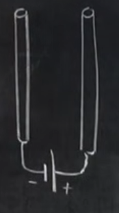  

### протилежно напрямлені струми
Якщо створити коротке замикання між двома провідниками, то вони будуть сильно відштовхуватися один від одного **магнітною** силою. Сила струму там буде декілька амперів.  
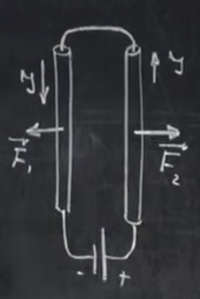  

    Протилежно напрямлені струми відштовхуються магнітною силою.

### співнапрямлені струми
    Якщо струми в провідниках будуть протікати в одному напрямку, то вони будуть притягуватися один до одного **магнітною** силою.
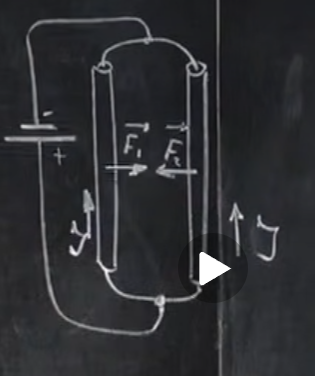  

## Дослід з рамкою
Рамка, по якій протікає струм підвішена поряд з провідником, по якому також протікає струм. В одній стороні рамки струм протікає в одному напрямку із струмом в провіднику, а в іншій стороні рамки струм протікає в протилежному напрямку із струмом в провіднику. Рамка буде обертатися, бо одна сторона рамки буде притягуватися до провідника, а інша сторона рамки буде відштовхуватися від провідника. Вона буде обертатися до тих пір, поки бік рамки із співнапрямленим струмом не буде максимально близько до провідника, а бік рамки із протилежно напрямленим струмом не буде максимально далеко від провідника.  
На лівому рисунку - початок обертання рамки, на правому - кінець обертання рамки.  
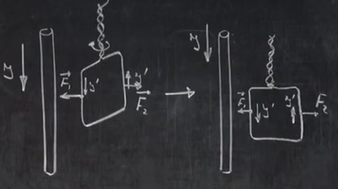  
Рис. 5. Рамка обертається під дією магнітної сили.  

 
Струм виявляє на рамку орієнтуючу дію.  
### Позначення напрямку сили на дошці
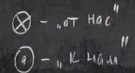  
Хрестик - бо стріла летить від нас, кружечок - бо стріла летить на нас.  

### Декілька рамок
Якщо дивитися на правий рисунок із рис. 5 зверху і розмістити навколо провідника струму декілька рамок по колу, вийде ось така картина:  
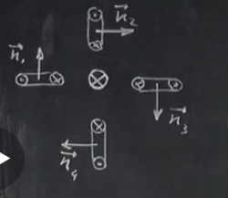  
**Додатня нормаль** ($\vec{n_1}, \vec{n_2}, \dots$) - це напрямок, який перпендикулярний до площини рамки. Можна уявити рамку і нормаль, як винний штопор. Два провідники - це краї ручки штопора, а нормаль - це вісь штопора. Обертаючи штопор в напрямку струмів, він буде рухатися в напрямку нормалі.  
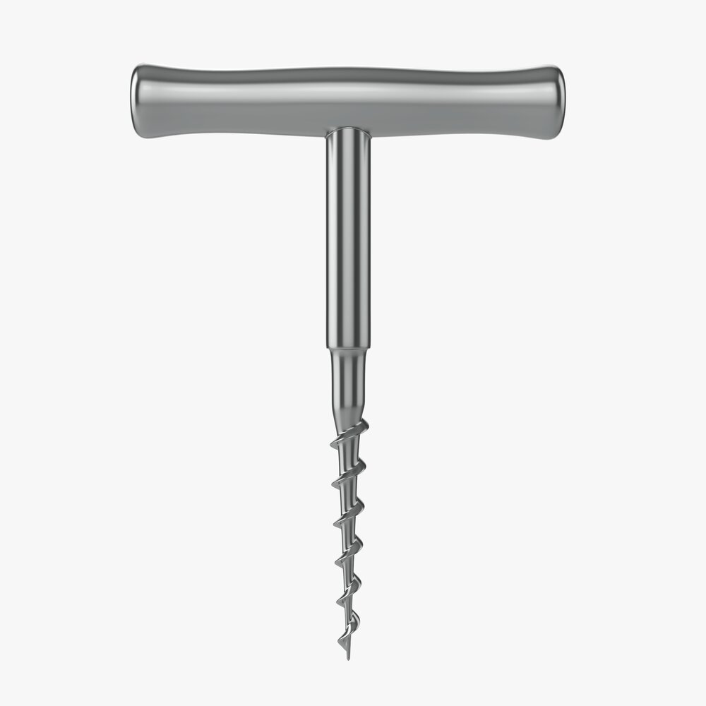  

Напрямок нормалей можна прийняти за напрямок магнітного поля. В різних точках простору магнітне поле, створене цим провідником, буде напрямлено в різні сторони.  

Якщо пустити по провіднику більший струм, на рамки буде діяти більший момент сили буде прагнути розвернути рамку. Тобто магнітне поле може бути як більше, так і менше. Тобто воно може бути охарактеризоване і числом і напрямком. Отже магнітне поле - це вектор. Цей вектор носить назву **вектор магнітної індукції**.  

$\vec{B}$ - вектор магнітної індукції.  

    За напрямок вектора магнітної індукції приймається напрямок додатньої нормалі рамки з током, що вільно розміщена в даній точці магнітного поля.  

## Визначення напрямку ветора магнітної індукції за допомогою магнітної стрілки  
Провідник із струмом має пропускати достатньо сильний струм, щоб можна було нівелювати вплив земного магнітного поля на магнітні стрілки.  
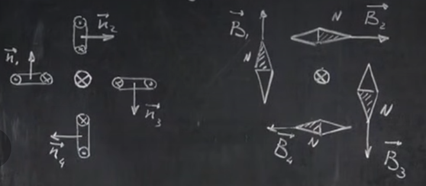  

    За напрямок ветора магнітної індукції приймається напрямок, що вказується північним полюсом магнітної стрілки, яка вільно розміщена в даній точці магнітного поля. 

## Як зображати магнітне поле на рисунках  
Замість того, щоб в кожній точці простору рисувати вектори магнітної індукції, зображаються лінії, дотичні до яких в кожній точці мають напрямок вектора магнітної індукції. Чим ближче лінії одна до одної, тим сильніше магнітне поле. Ці лінії називаються **лініями магнітної індукції**.  
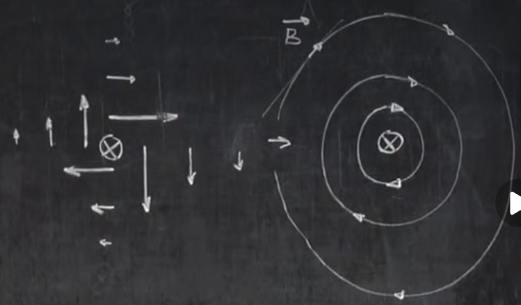  
**Лініями магнітної індукції** називаються лінії, дотичні до яких в кожній точці мають напрямок вектора магнітної індукції в цій точці.  

## Правило сверлика (гвинта)
Якщо сверлик переміщається в напрямку струму в провіднику, то напрямок обертання ручки сверлика вказує напрямок магнітних ліній поля, що створюється цим струмом навколо провідника.  

## Сила Ампера
Якщо помістити провідник із струмом в магнітне поле, то на нього буде діяти сила, що називається **силою Ампера**. Вона буде напрямлена перпендикулярно до напрямку струму в провіднику і перпендикулярно до напрямку магнітного поля.  
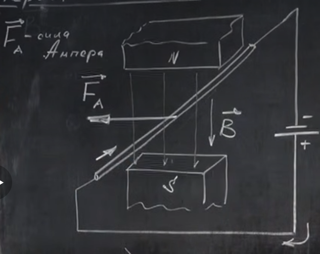  
Ця сила максимальна, коли струм в провіднику перпендикулярний до магнітного поля.  

Напрямок сили Ампера можна визначити за допомогою **правила лівої руки**: якщо розташувати ліву руку так, щоб лінії магнітного поля входили в долоню, а 4 витягнутих пальці вказували напрямок струму в провіднику, то відведений на 90° великий палець буде вказувати напрямок сили Ампера.  

