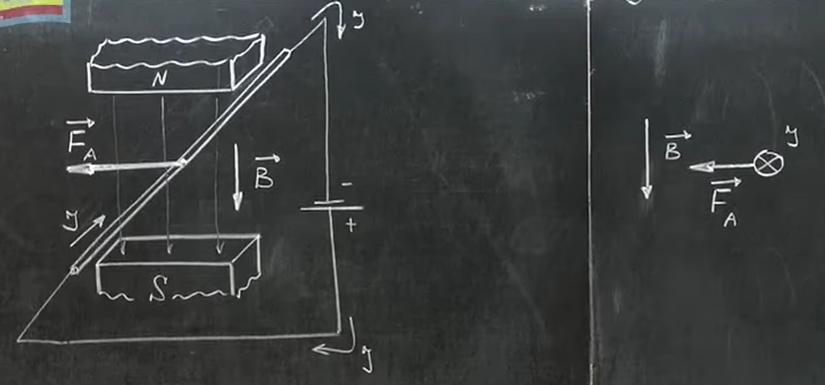
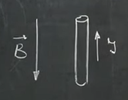
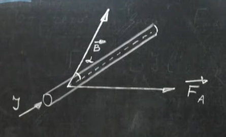
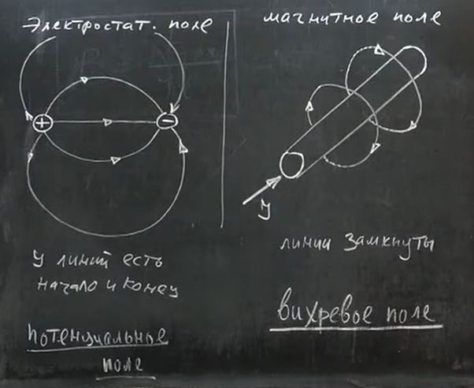
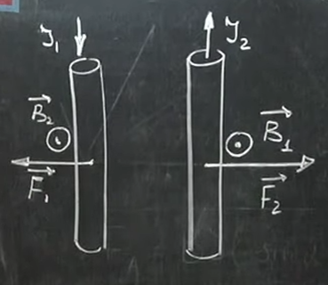

# Урок 271. Модуль вектора магнітної індукції. Закон Ампера
### перпендикулярний провідник
Справа зображено малюнок, який показує малюнок зліва під іншим кутом, в розрізі провідника.   
  
Рис. 1. Провідник перпендикулярний до зовнішнього  магнітного поля  

Сила Ампера при цьому набуває максимального значення. $F_A = F_{A_{max}}$.  

    Сила Ампера $F_A$ набуває максимального значення, коли провідник перпендикулярний до ліній магнітного поля.

### паралельний провідник
Тут показано провідник, який паралельний до зовнішнього магнітного поля. 
  
Рис. 2. Провідник паралельний до зовнішнього магнітного поля  

В даному випадку сила Ампера буде дорівнювати нулю, бо струм в провіднику не перетинає лінії магнітного поля. Тут неможливо поставити ліву руку так, щоб лінії магнітного поля входили в долоню, а 4 витягнутих пальці вказували напрямок струму в провіднику, бо ці два напрямки співпадають.  

Тобто сила Ампера $F_A = 0$.  

## Від чого залежить $F_{A_{max}}$
Розглядаємо для випадку, коли провідник перпендикулярний до ліній зовнішнього магнітного поля. **Важливо**: це працює для однорідного магнітного поля, в якому індукція магнітного поля має однакове значення в усіх точках провідника, а не, наприклад, по центру сильніше, а по бокам слабше, як це відбувається в реальному світі.

### Чому сила Ампера залежить від сили струму в провіднику?
$F_{A_{max}} \sim(\text{залежить від}) I$, де $I$ - сила струму в провіднику.

Струм - це кількість заряду, що проходить через провідник за секунду. Чим більше струм - тим більше електронів рухається повз поперечний переріз за одиницю часу (тобто вони рухаються швидше). У провіднику є багато вільних електронів, кожен отримує силу від магнітного поля. Чим швидше рухається електрон, тим сильніше на нього діє сила магнітна сила (магнітне поле "відхиляє" електрон в бік, це релятивістика). Сили, що діють на окремі електрони, сумуються і в результаті виходить сила Ампера, що діє на провідник.

### Чому сила Ампера залежить від довжини провідника?
$F_{A_{max}} \sim l$, де $l$ - довжина провідника.

На кожен сантиметр провідника діє певна сила. Але якщо наприклад взяти кусок провідника довжиною не 1 см, а 10 см, то на кожен із цих 10 сантиметрів буде діяти сила, яка при додаванні дає силу, що в 10 разів більша ніж для 1 сантиметра (через однорідність поля).   

### Залежність сили Ампера від магнітного поля
Беремо дві попередні формули і об'єднуємо їх в одну: $F_{A_{max}} \sim I \cdot l$. Чого ще не вистачає у формулі?  

Сила Ампера залежить також від магнітного поля. В більш сильному полі на провідник буде діяти більша сила. В слабкому полі - менша сила. 

$F_{A_{max}} \sim B$, де $B$ - індукція магнітного поля.

### Повна формула для сили Ампера
$F_{A_{max}} = B \cdot I \cdot l$.

Величина $B$ приймається за модуль вектора магнітної індукції.

$
B = \frac{F_{A_{max}}}{I \cdot l}
$ - модуль вектора магнітної індукції.

    Модулем вектора магнітної індукції називається фізична величина, що дорівнює відношенню максимальної сили, що діє на ділянку провідника з боку магнітного поля до довжини ділянки та сили струму в ньому.

$[B] = \frac{[F]}{[I] \cdot [l]} = \frac{H}{A \cdot м} = Tл$ - тесла, одиниця вимірювання індукції магнітного поля.

**1 тесла** - це індукція такого магнітного поля, в якому на ділянку провідника довжиною 1 м, зі струмом силою 1 А, з боку поля діє максимальна сила в 1 Н.  

## Що якщо провідник розташований під кутом до ліній магнітного поля?
Нехай провідник розташований під кутом $\alpha$ до ліній магнітного поля.

**Важливо**: $\vec{F_A} \perp \vec{B}$ а також $\vec{F_A} \perp \text{провіднику}$ завжди, незалежно від кута $\alpha$.  
  

Розкладемо вектор $B$ на дві взаємно перпендикулярні складові: $B_{||}$ - паралельна до провідника та $B_{\perp}$ - перпендикулярна до провідника.
Паралельна складова $B_{||}$ не діє на провідник, бо вона паралельна до нього. Тому сила Ампера від цієї складової буде нулем. На провідник діє лише перпендикулярна складова $B_{\perp}$.  
$F_A = B_{\perp} \cdot I \cdot l$  
$B_{\perp} = B \cdot \sin \alpha$ - перпендикулярна складова вектора магнітної індукції.  
$F_A = B \cdot I \cdot l \cdot \sin \alpha$ - **Закон Ампера**.  

**Закон Ампера**: модуль сили Ампера дорівнює добутку модуля вектора магнітної індукції, сили струму в провіднику, довжини провідника та синуса кута між напрямком поля та напрямком струму в провіднику.  

## Порівняння елктростатичного поля та магнітного поля
Для електростатичного поля силові лінії починаються на позитивних зарядах та закінчуються на негативних зарядах. Вони завжди мають початок та мають кінець.  
Магнітні лінії замкнуті, вони не мають ні початку, ні кінця. Вони завжди замкнуті в петлі.  
  

## Як описати взаємодію двох провідників зі струмом?
Ми вважаємо, що лівий провідник якимось чином діє на правий провідник.  
Лівий провідник створює поле $B_1$, що напрямлене на нас (правило правої руки або сверлика), воно діє на правий провідник. Використовуючи правило лівої руки, ми визначаємо напрямок сили Ампера, що діє на правий провідник. Вона діє вправо.  
Якщо розглядати правий провідник як джерело, що діє на лівий, отримуємо симетричну ситуацію.  
  

