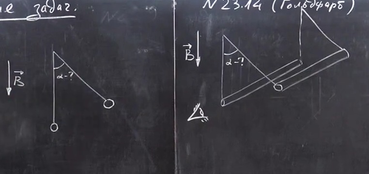
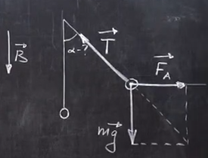

# Урок 272. Задачі на закон Ампера - 1
## №23.14 (Гольдфарб)
### Умова
Між полюсами магніта на двох тонких вертикальних дротах підвішений горизонтальний лінійний провідник масою 10 грам та довжиною 20 см. Індукція однорідного магнітного поля напрямлена вертикально та дорівнює 0.25 Тл. Весь провідник знаходиться в магнітному полі. На який кут $\alpha$ від вертикалі відхиляються дроти, що підтримують провідник, якщо по ньому пропустити струм силою 2 А? Масою дротів знехтувати.  

$m = 10 г = 0.01 кг$  
$l = 20 см = 0.2 м$  
$I = 2 А$  
$B = 0.25 Тл$  

---
$\alpha$ - ?

### Розв'язок
  
Струм напрямлено до нас.  

На малюнку зображено всі сили, що діють на провідник.  

\vec{T} - це сила натягу дротів, що підтримують провідник.  

**Умова рівноваги** провідника  
$$m\vec{g} + \vec{T} + \vec{F_A} = 0$$