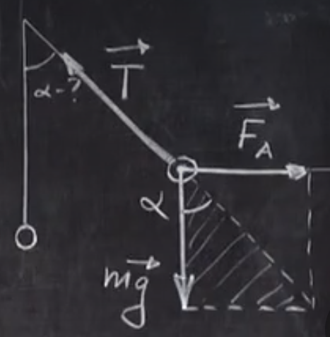
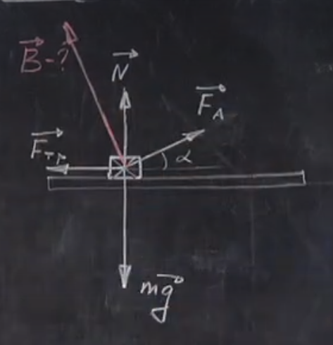
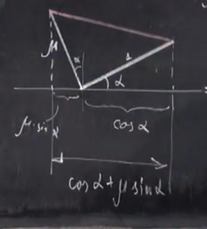
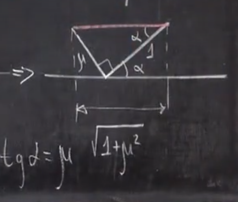

# Урок 272. Задачі на закон Ампера - 1
## №23.14 (Гольдфарб)
### Умова
Між полюсами магніта на двох тонких вертикальних дротах підвішений горизонтальний лінійний провідник масою 10 грам та довжиною 20 см. Індукція однорідного магнітного поля напрямлена вертикально та дорівнює 0.25 Тл. Весь провідник знаходиться в магнітному полі. На який кут $\alpha$ від вертикалі відхиляються дроти, що підтримують провідник, якщо по ньому пропустити струм силою 2 А? Масою дротів знехтувати.  

$m = 10 г = 0.01 кг$  
$l = 20 см = 0.2 м$  
$I = 2 А$  
$B = 0.25 Тл$  

---
$\alpha$ - ?

### Розв'язок
  
Струм напрямлено до нас.  

На малюнку зображено всі сили, що діють на провідник.  
  
$\vec{T}$ - це сила натягу дротів, що підтримують провідник.  

**Умова рівноваги** провідника:  
$$m\vec{g} + \vec{T} + \vec{F_A} = 0$$

З рисунку видно:  
  

$$\tg \alpha = \frac{F_A}{mg}$$

$F_A = B \cdot I \cdot l \cdot \sin 90^\circ = B \cdot I \cdot l$  

$90^\circ$ - це кут між струмом в провіднику та лініями магнітного поля, вони перпендикулярні один одному.  

$\tg \alpha = \frac{B \cdot I \cdot l}{mg}$

$\tg \alpha = \frac{0.25 \cdot 2 \cdot 0.2}{0.01 \cdot 10} = 1$

$\alpha = 45^\circ$.

## №23.11 (Гольдфарб)
### Умова
Горизонтальні рельси знаходяться на відстані 0.3 м одне від одного. На них лежить стержень, перпендикулярний рельсам. Якою має бути індукція магнітного поля, для того, щоб стержень почав рухатися, якщо по ньому пропускається струм силою 50 А. Коефіцієнт тертя стержня об рельси дорівнює 0.2, а маса стержня - 0.5 кг?

$l = 0.3 м$  
$I = 50 А$  
$\mu = 0.2$  
$m = 0.5 кг$  

---

$B_{min}$ - ?

---

Силу треба направляти не горизонтально, а під кутом $\alpha$ до горизонту. Це робиться для того, щоб трохи нівелювати силу тертя, "припіднімаючи" стержень за допомогою сили Ампера.  
  

Умова рівноваги стержня (ще не поїхав):
$$m\vec{g} + \vec{F_A} + \vec{N} + \vec{F_{тер}} = \vec{0}$$

Проекція на вісь $x$:  
$OX$: $-F_{тер} + F_A \cdot \cos \alpha = 0$  
$OY$: $-mg + N + F_A \cdot \sin \alpha = 0$  

Перед початком руху $F_{тер}$ **спокою** максимальна і дорівнює $\mu N$.  
$F_{тер} = \mu N$ (3)   
Сила тертя спокою міняється від нуля до $\mu N$ і потім переходить у силу тертя ковзання (предмет починає рухатися).  

Далі з формул:  
$F_{тер} = F_A \cdot \cos \alpha$  
$N = mg - F_A \cdot \sin \alpha$ (тут видно, що $N$ менше ніж $mg$ за рахунок того, що сила Ампера напрямлена під кутом до горизонту і має вертикальну складову, яка "піднімає" стержень).  

Підставляємо результати у формулу (3):
$F_A \cdot \cos \alpha = \mu mg - \mu F_A \cdot \sin \alpha$  
$F_A \cdot (\cos \alpha + \mu \sin \alpha) = \mu mg$  

$F_A = B \cdot I \cdot l \cdot \sin 90^\circ = B \cdot I \cdot l$

$B \cdot I \cdot l \cdot (\cos \alpha + \mu \sin \alpha) = \mu mg$ 

$B = \frac{\mu mg}{I \cdot l \cdot (\cos \alpha + \mu \sin \alpha)}$  

В цю формулу входить кут $\alpha$. Тобто в залежності від того, під яким кутом ми нахиляємо вектор магнітної індукції, вектор $B$ буде мати різний модуль.

Нам треба знайти мінімальне значення $B$. Для цього значення в дужці із кутом $\alpha$ в знаменнику має бути максимальним.  

$B = B_{min}$, якщо $\cos \alpha + \mu \sin \alpha$ - максимальне.  

Знайти значення $\alpha$, при якому $\cos \alpha + \mu \sin \alpha$ - максимальне можна геометричним методом. $\mu$ та одиничний відрізок виставлені довільно, але $\mu$ перпендикулярний одиничному відрізку. Треба, щоб червона лінія була паралельна горизонту, тоді ця довжина буде максимальною.  
  
По теоремі Піфагора максимальна довжина червоної лінії буде дорівнювати $\sqrt{1 + \mu^2}$.  
  

Відповідь:  
$B_{min} = \frac{\mu mg}{I \cdot l \cdot \sqrt{1 + \mu^2}}$.