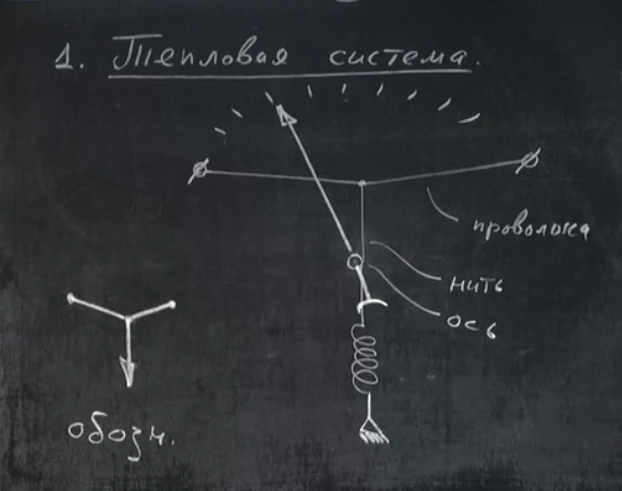
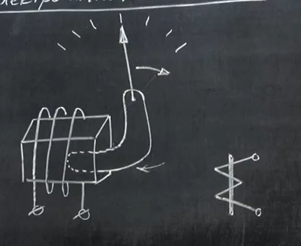
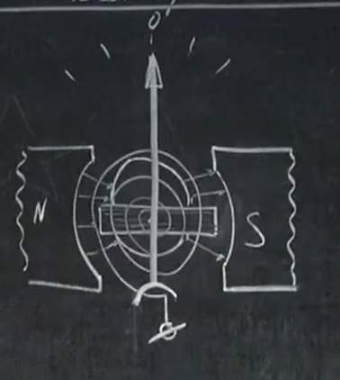
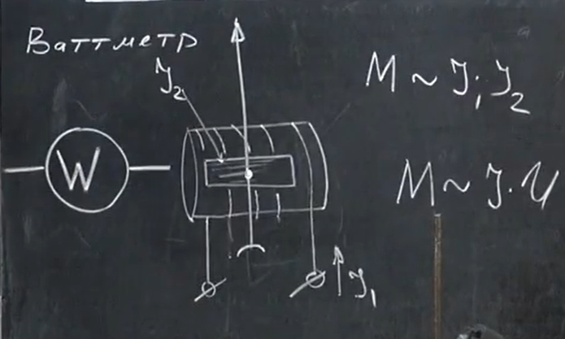

# Урок 275. Електровимірювальні пристрої. Гучномовці
Системи електровимірювальних пристроїв
## 1. Теплова система
Вимірюємо струм по тому, як прогинається дріт від нагрівання, коли по ньому тече струм. Навколо осі крутиться стрілка і дає покази. Цей прилад не залежить від того, в яку сторону тече струм, а залежить тільки від кількості теплоти, що буде виділятися. Тобто можна вимірювати як змінний так і постійний струм.    
  

## 2. Електромагнітна система
В котушку втягується залізний сердечник і до нього прикріплена стрілка, яка вказує на шкалу. Коли по котушці тече струм, то сердечник втягується і стрілка повертається. Чим більше сила струму в котушці, тим більше буде відхилення стрілки. Незалежно від того, в яку сторону тече струм, сердечник весь час буде втягуватися (бо це не магніт, а звичайний метал).   
  

## 3. Магнітоелектрична система
Основний елемент - рамка зі струмом в магнітному полі. Пропускаємо через рамку струм - вона обертається на певний кут.   
  

## 4. Електродинамічна система
Магнітне поле створюється електромагнітом (котушкою). Всередині поля поміщена рамка зі струмом, яка може обертатися. Момент обертання стрілки пропорційний як силі струму в рамці ($I_2$), так і силі струму в котушці ($I_1$). Цей прилад може вимірювати як змінний, так і постійний струм.  
  
