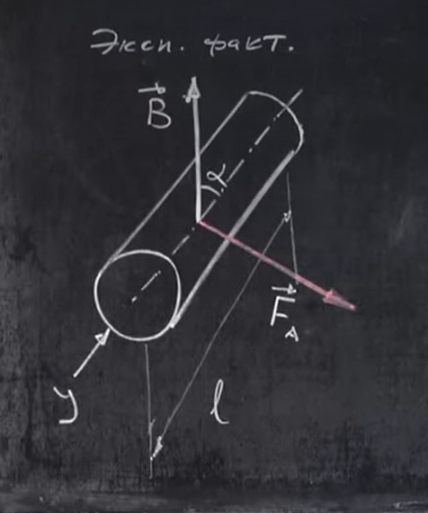
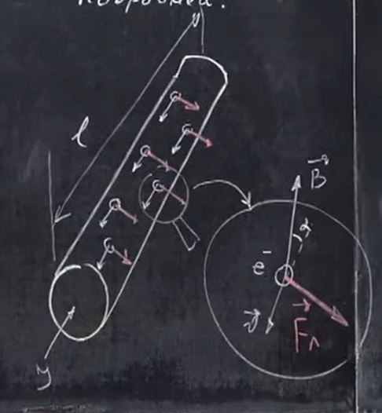
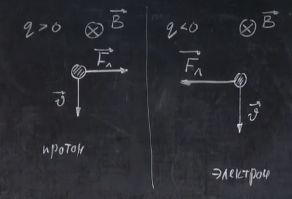
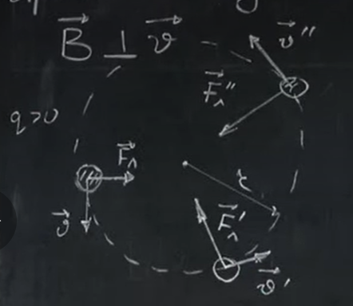

# Урок 276. Сила Лоренца. Рух заряджених частинок в магнітному полі
У цьому уроці розберемося, **чому** на провідник зі струмом діє сила Ампера.  

Експерементально доведений факт:  
  
$$ F_A = BIL\sin\alpha (1)$$

### Детальніше
В провіднику знаходяться вільні носії заряду. І на ці носії заряду діє сила Лоренца $F_л$.  
  
Сила, яка діє на заряджену частинку, що рухається в магнітному полі, називається **силою Лоренца**.  
Сила Ампера - це рівнодійна всіх сил Лоренца, які діють на всі **рухомі носії заряду** в провіднику.  
$t = l/v$ - час, за який заряджена частинка проходить довжину провідника. $v$ - дрейфова швидкість носіїв заряду.  
За цей час по провіднику пройде заряд $q_{заг}$.  
$ q_{заг} = I \cdot t = I \cdot \frac{l}{v} $
# Мені інтуїтивно не зрозуміло, чому час, за який одна частинка проходить провідник дорівнює тому часу, що входить у формулу $q_{заг} = I \cdot t$

  
Пояснення

$t=l/v$ — це **не одна секунда**, а час, за який носій заряду проходить весь провідник.

---

## Що означає $q=I t$

Формула

$
q=It
$

означає: через будь-який поперечний переріз провідника за час $t$ пройде заряд $q$.

Якщо взяти

$
t=\frac{l}{v},
$

то

$
q_{\text{заг}}=I\frac{l}{v}
$

— це заряд, який пройде через переріз за той час, поки один електрон дрейфує вздовж усього провідника (тобто поки летить один електрон, ми дивимося, який заряд проходить через переріз за час його польоту).

Цей заряд справді дорівнює сумарному заряду всіх носіїв, що одночасно знаходяться всередині провідника.

---

## Чому це працює

Уяви провідник довжини $l$.

Електрони рухаються з дрейфовою швидкістю $v$.

За час

$
t=\frac{l}{v}
$

кожен електрон зміститься на довжину провідника.

За цей самий час через вхідний переріз зайде рівно стільки заряду, скільки вже міститься всередині провідника.

Тому

$
Q_{\text{всередині}}=I\frac{l}{v}.
$

Це не заряд, що проходить за секунду, а весь заряд носіїв у даному відрізку провідника.

---

Інтуїтивно: коли ти береш $t=l/v$, ти не рахуєш «скільки частинок проходить за секунду». Ти рахуєш «скільки частинок одночасно перебуває всередині провідника». Саме на них усіх одночасно діє сила Лоренца, тому їх кількість і потрібна для виведення сили Ампера.

---
---
---

Сила ампера буде дорівнювати сумі всіх сил Лоренца, Кількість цих сил буде дорівнювати кількості заряджених частинок, які проходять через провідник за одиницю часу.  
$ F_A = F_л \cdot N $  
Кількість часток дорівнює всьому заряду, який проходить через провідник за одиницю часу, поділеному на заряд однієї частинки.  
$ N = \frac{q_{заг}}{q}$  
$N = \frac{I \cdot l}{v \cdot q}$  
$ F_A = F_л \frac{I \cdot l}{v \cdot q} (2) $  

Прирівняємо (1) та (2) і отримаємо:  
$ BIL\sin\alpha = F_л \frac{I \cdot l}{v \cdot q} $  
Звідси:  
$$ F_л = |q|vB\sin\alpha $$
$\alpha$ - кут між напрямком руху частинки ($\vec{v}$) та напрямком магнітного поля ($\vec{B}$).  

**Важливо**:  
Сила Лоренца буде максимальною ($F_л = max$), коли $\alpha = 90^\circ$, тобто коли напрямок руху частинки перпендикулярний до напрямку магнітного поля ($\vec{v} \perp \vec{B}$).

Сила Лоренца буде нульовою ($F_л = 0$), коли $\alpha = 0^\circ$ або $\alpha = 180^\circ$, тобто коли напрямок руху частинки паралельний до напрямку магнітного поля ($\vec{v} \parallel \vec{B}$).

### Як визначити напрям сили Лоренца?
Якщо частина заряджена позитивно, то вона рухається в напрямку струму. Отже при використанні правила лівої руки, пальці будуть показувати на напрямок руху частинки.  
Якщо частинка заряджена негативно, то вона рухається в напрямку, протилежному до струму. Чотири пальці руки все ще вказують на напрямок **струму**, а не руху частинки, напрямок руху частинки протилежний до напрямку струму. Тому сила Лоренца буде діяти в протилежному напрямку до сили, яка діє на позитивно заряджену частинку.  
**Важливо**: $F_л \perp \vec{v}$ та $F_л \perp \vec{B}$, сила Лоренца завжди буде перпендикулярною до напрямку руху частинки та до напрямку магнітного поля.
  

### Як частинка буде рухатися в магнітному полі?
Якщо на частинку діє сила, то ця сила має змінювати швидкість частинки. Але сила Лоренца не змінює модуль швидкості частинки, а лише змінює напрямок руху частинки (бо вони перпендикулярні). Тобто потужність сили Лоренца дорівнює нулю, вона не змінює кінетичну енергію, а отже не виконує роботи.  
#### Найпростіший випадок
$\vec{B} \perp \vec{v}$  
Частинка буде рухатися по колу. Сила Лоренца виконує роль центробіжної сили.  
  

Другий закон Ньютона для руху по колу:
$ \vec{F_л} = m\vec{a}^2 $  
$F_л = ma^2$  
$a = \frac{v^2}{r}$ - центробіжне прискорення.  
$F_л = qvB\cdot1$  
Прирівнюємо:  
$ qvB = m\frac{v^2}{r} $  
Звідси:
$$ r = \frac{mv}{qB} $$
З формули висновки:  
- чим більше швидкість руху частинки, тим більше радіус кола, по якому вона рухається.

$T$ - період обертання частинки по колу (час одного оберту). Час, за який частинка проходить довжину кола.  
$T = \frac{2\pi r}{v}$  
Підставляємо $r$:
$$ T = \frac{2\pi m}{qB} $$
Цікавий факт: $T$ не залежить від швидкості руху частинки. Просто в повільніших частинок будуть менші радіуси кола, а в швидших - більші радіуси кола, але час одного оберту буде однаковим. Це можна зрозуміти і з того, що радіус прямо пропорційний швидкості, і змінюючи швидкість у $n$ разів, радіус також змінюється у $n$ разів.