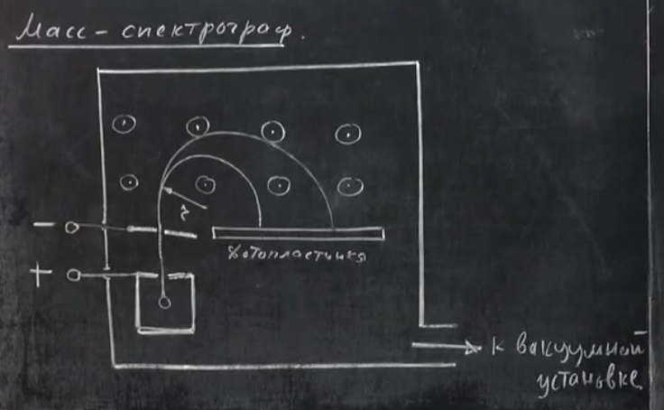
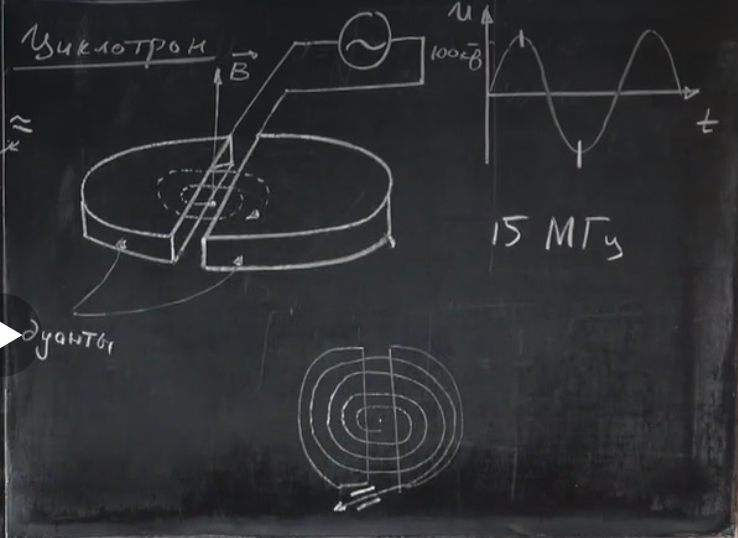
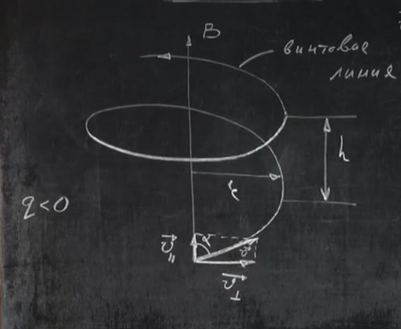
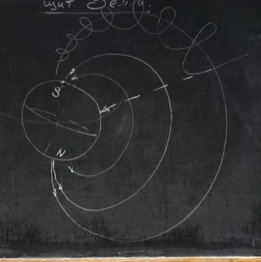

# Урок 277. Масс-спектрограф. Циклотрон. Магнітний щит Землі
## Масс-спектрограф
  

Уявимо собі джерело заряджених частинок. У нього є невеликий отвір, з якого вилітають заряджені частинки. Частинки розганяються електричним колом (між + та -).  
Кінетична енергія, яку отримують частинки, з'являється за рахунок роботи електричного поля ($A = |q|U$).  
$mv^2/2 = |q|U$  
звідси можна знайти швидкість частинки:
$$v = \sqrt{\frac{2|q|U}{m}}$$

з такою швидкістю частинки вилітатимуть із другої дюрки (там де "-").

# Що таке напруга

Пояснення

Одним словом, напруга визначає, скільки енергії припадає на одиницю заряду при переміщенні між двома точками.

Інтуїтивно **напруга** — це те, наскільки сильно електричне поле "хоче" перемістити заряд з однієї точки в іншу.

Найкраща аналогія — вода.

* **Заряд** → вода.
* **Струм** → потік води.
* **Напруга** → різниця висот або тиску, яка змушує воду текти.

Якщо є дві ємності на різній висоті, вода сама потече зверху вниз. Чим більша різниця висот, тим сильніше вона прагне текти.

З електрикою так само:

* якщо між двома точками є напруга, заряди прагнуть рухатися;
* якщо напруги немає, то немає й причини для їхнього спрямованого руху.

## Що це означає фізично

Уяви електрон.

Якщо він знаходиться між двома точками з різною напругою, то електричне поле може надати йому енергію для руху.

Тому напругу можна розуміти як:

> кількість енергії, яку отримає одиничний заряд при переміщенні між двома точками.

Наприклад:

* батарейка 1.5 В може передати 1.5 джоуля енергії кожному кулону заряду;
* батарейка 9 В — уже 9 джоулів на кулон.

## Чому напруга завжди між двома точками

Часто кажуть:

> "На батарейці 9 вольт."

Насправді правильніше:

> "Між клемами батарейки різниця потенціалів 9 вольт."

Напруга — це не властивість однієї точки, а різниця між двома точками.

Аналогія:

* не можна сказати, що гора має висоту 500 м без точки відліку;
* так само не можна говорити про напругу без двох точок для порівняння.

## Коротко

* **Струм** — рух зарядів.
* **Напруга** — причина, через яку заряди рухаються.
* **Опір** — те, що заважає їхньому руху.

Тому в електричному колі напруга відіграє роль, схожу на різницю висот або тиску в системі з водою.

---
---
---

У просторі, в який вилітають частинки, створимо однорідне магнітне поле, напрямлене "на нас". Таким чином вилетівша частинка буде рухатися по колу.  

$|q|vB = \frac{mv^2}{r}$  
звідси радіус кола:  
$r = \frac{mv}{|q|B}$  
Підставляємо $v$ і отримуємо:  
$r = \frac{m}{|q|B}\sqrt{\frac{2|q|U}{m}}$  
$$r = \frac{1}{B}\sqrt{\frac{2mU}{|q|}}$$
Знаючи радіус коли, можна визначити питомий заряд частинки і зрозуміти, що це за частинка. Щоб зрозуміти, куди попала частинка, можна поставити фотопластинку, яка буде засвічуватися в місці удару частинки, якщо її проявити.  
Цей пристрій називається **масс-спектрографом**. Він дозволяє визначити масу та заряд частинки, а отже і її тип. Вся ця конструкція знаходиться в вакуумі, щоб частинки не стикалися з повітрям і не гальмувалися.  

## Циклотрон
   
Дуанти - дві металічні напівкруглі коробки. Створимо магнітне поле, перпендикулярне площині дуантів і запустимо протон в проміжок між дуантами. Під дією магнітного поля він буде рухатися по колу.  
Період його обертання:  
$T = \frac{2\pi r}{v}$  
$r = \frac{mv}{|q|B}$
Підставляємо $r$:
$ T = \frac{2\pi m}{|q|B} $  
Циклотронна частота обертання:  
$ n = \frac{1}{T}$  
$$ n = \frac{|q|B}{2\pi m} $$

Цей протон підштовхується електричним полем, для цього до дуантів підключається генератор змінної напруги. Якщо частота зміни збігається з частотою обертання протона, то в потрібні моменти часу напруга буде змінювати напрям і тим самим підштовхувати протон, збільшуючи його швидкість.  
Важливо розуміти, що частота обертання не буде змінюватися, бо вона не залежить від його швидкості. Швидкість обертання буде збільшуватися, а отже буде і збільшуватися радіус обертання частинки. І коли радіус збільшиться до максимуму, частинка вилетить з дуантів через отвір.

### Протонний циклотрон
маса протона $m = 1.67 \cdot 10^{-27}$ кг, заряд $q = 1.6 \cdot 10^{-19}$ Кл. Якщо магнітне поле $B = 1$ Тесла, то частота обертання буде:  
$n = \frac{1.6 \cdot 10^{-19} Кл \cdot 1 Н}{А \cdot м \cdot 6,28 \cdot 1.67 \cdot 10^{-27} кг}$ = $ \frac{1.6 \cdot 10^{-19} Кл \cdot 1 м}{А \cdot м \cdot 6,28 \cdot 1.67 \cdot 10^{-27} с^2} \approx 15 \cdot 10^6 Гц = 15 МГц$

## Випадок, коли частинка влітає під кутом в магнітне поле
  
Розділимо швидкість частинки на дві складові: перпендикулярну до магнітного поля $\vec{v_\perp}$ і паралельну до магнітного поля $\vec{v_\parallel}$.  
$\vec{v} = \vec{v_\perp} + \vec{v_\parallel}$  

Якби діяла тільки перпендикулярна складова, то частинка рухалася б по колу з радіусом $r = \frac{m v_\perp}{|q|B}$. Якби діяла тільки паралельна складова, то частинка б не змінювала напрямок руху. І частинка рухалася б по *гвинтовій лінії*.  
Крок гвинта $h$ - це відстань між сусідніми витками гвинта. Це відстань, яку частинка проходить за один період обертання.  
$h = v_\parallel T$  

$V_\perp = v \sin \alpha$  
$V_\parallel = v \cos \alpha$

$$r = \frac{m v \sin \alpha}{|q|B}$$

$T = \frac{2\pi m}{|q|B}$  
$$h = \frac{2\pi m}{|q|B} \cdot  v \cos \alpha$$

## Магнітний щит Землі
  
Земля має магнітне поле, яке захищає нас від заряджених частинок (радіація), які летять з космосу. Якщо б не було цього магнітного поля, то ці частинки б вбивали все живе на Землі. Магнітне поле відхиляє ці частинки і вони летять в інші напрямки.  

# Чому чим більше B, тим менше радіус обертання?
$$ r = \frac{mv}{qB} $$

Пояснення

Інтуїтивно — тому що сильніше магнітне поле **сильніше "завертає" частинку**.

Уяви автомобіль, який їде з однаковою швидкістю.

* Якщо трохи повернути кермо — вийде велике коло.
* Якщо сильно повернути кермо — вийде маленьке коло.

Швидкість однакова, але сила повороту різна.

Для зарядженої частинки роль "керма" виконує магнітне поле (B).

---

Ще одна аналогія.

Уяви, що ти крутиш камінь на мотузці.

* Якщо тягнути мотузку слабко — камінь описуватиме велике коло.
* Якщо тягнути сильніше — коло стане меншим.

Магнітне поле теж виконує роль сили, яка постійно "тягне" траєкторію всередину.

Чим більше (B), тим сильніше ця сила, тим різкіше змінюється напрямок руху, і тим менший радіус.

---

Можна подивитися ще так:

Припустимо, електрон за 1 наносекунду пролітає 1 см.

* Слабке поле за цей час поверне його лише на 1°.
* Сильне поле поверне на 20°.

Якщо кожної миті повертати траєкторію сильніше, то замість великого плавного кола вийде компактніше коло.

Саме тому в формулі

$
r = \frac{mv}{qB}
$

радіус обернено пропорційний (B):

* збільшив (B) у 2 рази → радіус зменшився у 2 рази;
* збільшив (B) у 10 разів → радіус зменшився у 10 разів.

Фізичний зміст: **сильніше магнітне поле швидше змінює напрямок руху частинки, тому вона не встигає далеко відлетіти від центру свого кола.**

---
---
---

Чим ближче частинка підлітає до Землі, тим сильніше діє на неї магнітне поле і тим менше її радіус обертання. По суті більшість часточок летить до полюсів і ми можемо бачити їх як полярні сяйва.  

