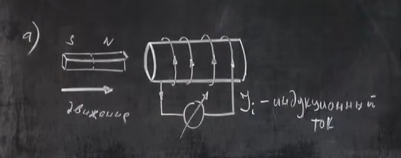
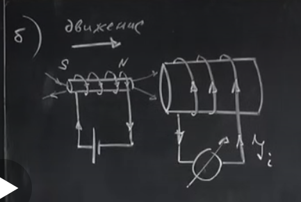
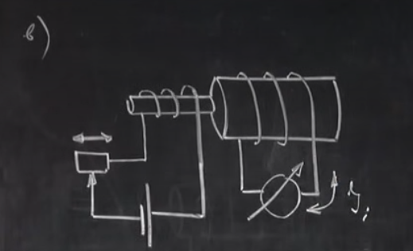
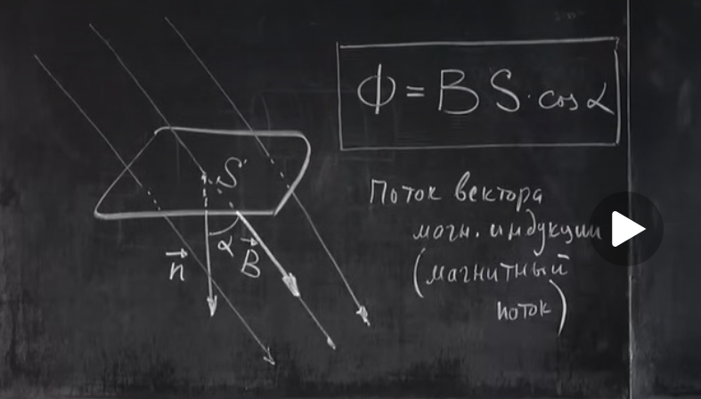
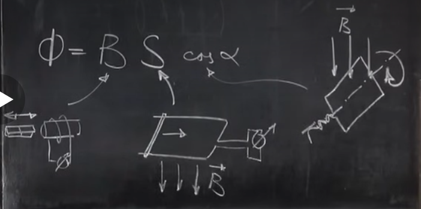
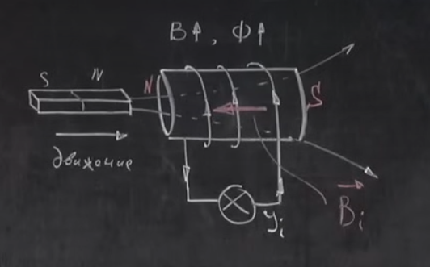

# Магнітний потік. Правило Ленца
17 Жовтня 1831 р. - відкриття електромагнітної індукції Майклом Фарадеєм.  
## Експеримент Фарадея (а)
  
Котушка під'єднана до гальванометра. Якщо вставити магніт в котушку, то стрілка гальванометра відхилиться (по котушці потече **індукційний струм** $I_i$). Якщо витягнути магніт з котушки, то стрілка відхилиться в інший бік. Якщо магніт не рухати (навіть всередині котушки), то з часом стрілка гальванометра повернеться в початкове положення.

## Інший експеримент Фарадея (б)
  
Замість магніту можна використовувати іншу меншу котушку, під'єднану до джерела струму. Ефект буде такий самий. 

## Ще один експеримент Фарадея (в)
  
В цьому експерименті, котушки не рухаються, але змінюється сила струму в одній з котушок. В результаті, в наслідок зміни струму в одній котушці, в ній змінюється магнітне поле, і в другій котушці також виникає індукційний струм.

## Потік вектора магнітної індукції (або магнітний потік)
  
$$\Phi = B \cdot S \cdot \cos\alpha$$
**Потоком вектора магнітної індукції через деяку поверхню** називається фізична величина, що дорівнює добутку модуля вектора магнітної індукції $B$ на площу поверхні $S$, помножену на косинус кута $\alpha$ між напрямком вектора магнітної індукції та нормаллю до поверхні.  
[$\Phi$] = Тл $\cdot$ м$^2$ = вебер (Вб)  
**1 вебер** - це магнітний потік, який створюється полем індукцією 1 Тесла через поверхню площею 1 м$^2$, що розташована перпендикулярно до напрямку магнітного поля.  

  
Всіма способами з малюнку можна отримати індукційний струм:  
- змінюючи магнітне поле $B$ рухаючи меншу котушку в більшу;
- змінюючи площу поверхні $S$ (повзунком, що зліва, зменшуємо площу рамки);
- змінюючи кут $\alpha$ (обертаючи рамку в магнітному полі).  

Тобто явище електромагнітної індукції виникає тоді, коли змінюється магнітний потік $\Phi$.

**Електромагнітною індукцією** називається явище виникнення електричного струму в замкнутому контурі при *зміні магнітного потоку* через цей контур.  

При зміні магнітного потоку з'являється ЕРС (електрорушійна сила) індукції $\mathcal{E}_i$, яка викликає індукційний струм $I_i$.

## Правило Ленца
**Правило Ленца**: ЕРС індукції напрямлена так, щоб **магнітне поле індукційного струму** **протидіяло** **зміні** магнітного потоку, що викликав цей струм.  

$\vec{B_i}$ - магнітне поле індукційного струму, що створене індукційним струмом.  
  
Котушки відштовхуються. По суті велика котушка протидіє зусиллям людини по "впиханню" маленької котушки. Людина має виконувати роботу, яка потім перетворюється в роботу електричного струму у великій котушці. Правило Ленца є особливим випадком фундаментального закону збереження енергії.