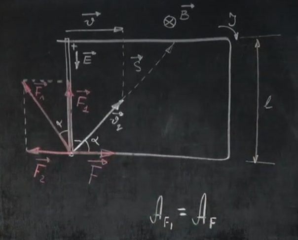
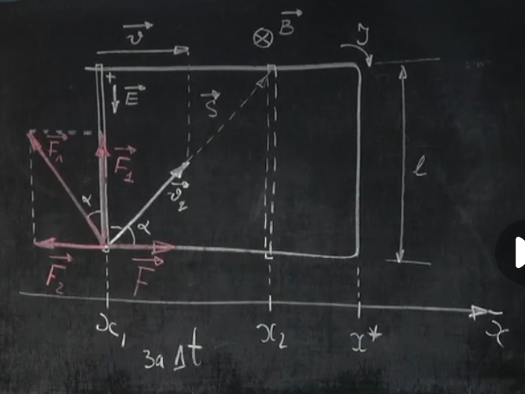

# Урок 282. Закон Фарадея для електромагнітної індукції
    
Візьмемо рамку зі струмом з рухомою перемичкою (зліва). Коли переміщається перемичка, змінюється площа контура, а отже змінюється магнітний потік, а отже в ньому виникає індукційний струм. Оскільки зменшуючи площу ми зменшуємо магнітний потік, то індукційний струм буде протидіяти цьому зменшенню, тобто він буде спрямований за годинниковою стрілкою.  

Мало того: коли ми рухаємо перемичку, заряди (ми для простоти вважаємо їх позитивними) що знаходяться в ній, починають рухатися разом з нею, тобто ми створюємо свого роду ще один електричний струм напрямлений вправо (швидкість $v$). Через це на ці заряди діє сила Лоренца, яка спрямована вгору, яка перемістить зарядки вгору і там буде надлишок зарядів, а знизу буде дефіцит зарядів. В результаті між верхньою та нижньою частиною перемички виникне різниця потенціалів і буде електричне поле, яке буде заважати зарядам рухатися прискорено, коли напруженість електричного поля урівноважить силу Лоренца, створиться рівномірний рух зарядів.  

Швидкість $\vec{v_q}$ - це абсолютна швидкість зарядів відносно нас (спостерігачів). $v = v_q \cdot \cos \alpha$ - це швидкість руху перемички.  

$v_q = \frac{v}{\cos \alpha}$.  

Сила Лоренца ($\vec{F_л}$) насправді не напрямлена вгору, вона **завжди** перпендикулярна до швидкості заряду і до магнітного поля. $F_л = qv_qB = \frac{qvB}{\cos \alpha}$.  

Силу Лоренца розкладаємо на дві складові: перпендикулярну до перемички ($\vec{F_2}$) та паралельну до перемички ($\vec{F_1}$). $\vec{F_л} = \vec{F_1} + \vec{F_2}$. Сила $\vec{F_1}$ змушує рухатися заряди проти електричної сили (**стороння сила**).  

Ми рухаємо рамку із силою $\vec{F}$, яка спрямована вправо. Щоб струм був рівномірним, сила $\vec{F}$ повинна урівноважувати силу $\vec{F_1}$, тобто $F = F_1$.

Вектор $\vec{S}$ - це вектор переміщення носіїв заряду.  

Робота сили Лоренца $A_{F_л} = F_л \cdot S \cdot \cos \beta$. $\beta = 90^\circ$, тому $A = 0$. Сила Лоренца не виконує роботу, вона лише змінює напрямок руху зарядів. Робота сили Лоренца - це сума робіт складових сил Лоренца: $A_{F_л} = A_{F_1} + A_{F_2} = 0$.   
Звідси: $A_{F_1} = - A_{F_2}$.  

Робота сили, що змушує рухатися провідник - $A_F$. Вона протилежна до роботи сили $F_2$.  
$A_F = -A_{F_2} = A_{F_1}$.  

$A_F = A_{F_1}$. Робота сторонньої сили виконується за рахунок нашої роботи по переміщенню провідника (закон збереження Енергії).  

$A_{F_1} = F_1 \cdot l = F_л \cdot \cos \alpha \cdot l = qB \cdot \frac{v}{\cos \alpha} \cdot \cos \alpha \cdot l$  
$A_{F_1} = Blvq$ - це робота сторонньої сили по переміщенню заряду $q$ по перемичці.  
ЕРС індукції $\varepsilon_i = \frac{A_{F_1}}{q}$ - це робота сторонньої сили по переміщенню одиничного заряду по перемичці.  
$$\varepsilon_i = Blv$$

## Продовження
  
$x_1$ - початкове положення перемички на осі $x$. $x_2$ - кінцеве положення перемички на осі $x$. $x^*$ - край замкнутого контура. Переміщення відбулось за проміжок часу $\Delta t$.  
$v = \frac{x_2 - x_1}{\Delta t}$  
Якщо підставити сюди $x^*$:  
$v = \frac{(x^* - x_1)-(x^* - x_2)}{\Delta t}$

$\varepsilon_i = Blv = Bl \cdot \frac{(x^* - x_1)-(x^* - x_2)}{\Delta t} = \frac{B}{\Delta t} \cdot [l(x^* - x_1) - l(x^* - x_2)] (1)$  
$S_1 = l(x^* - x_1)$ - це площа прямокутника, в якого сторона $l$ і сторона $(x^* - x_1)$, це початкова площа замкнутого контура.  
$S_2 = l(x^* - x_2)$ - це площа прямокутника, в якого сторона $l$ і сторона $(x^* - x_2)$, це кінцева площа замкнутого контура.

$(1) = \frac{1}{\Delta t} \cdot BS_1 - BS_2 (2)$  
$\phi_1 = BS_1$ - це магнітний потік на початку  
$\phi_2 = BS_2$ - це магнітний потік в кінці  

$\phi_1 - \phi_2 = -\Delta \phi$ - це від'ємна зміна магнітного потоку.  
$(2) = -\frac{\Delta \phi}{\Delta t}$  

### Закон Фарадея для електромагнітної індукції:
$$\varepsilon_i = -\frac{\Delta \phi}{\Delta t}$$
    ЕРС індукції в контурі чисельно дорівнює відношенню зміни магнітного потоку через контур до часу, за який ця зміна відбулася. 

