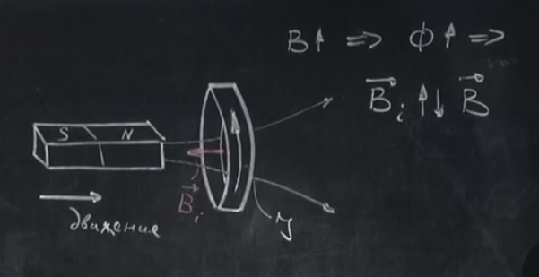
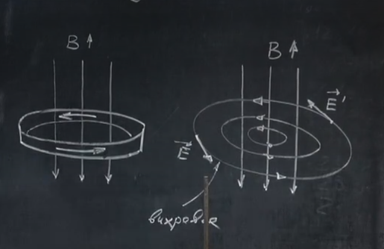
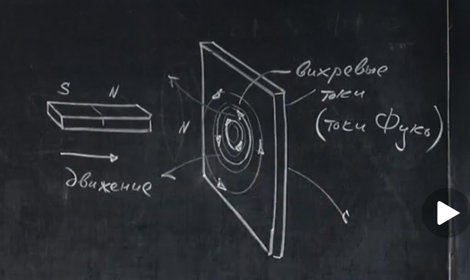
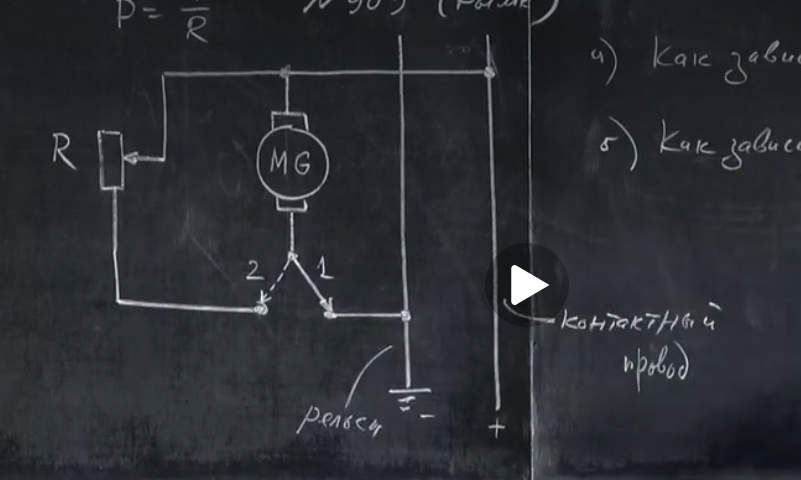

# Урок 283. Вихрове електричне поле. Струми Фуко
  
У нас є мідне кільце. Ми рухаємо постійний магніт в бік центру кільця. В кільці виникає індукційний струм, який створює власне магнітне поле $\vec{B}_i$. Це поле спрямоване так, щоб протидіяти зміні магнітного потоку, який створює зовнішній магніт $\vec{B}$.  
$\vec{B}_i ⇵ \vec{B}$.  

Навіть якби провідника не було, зміна магнітного потоку все одно створювало б замкнуте (вихрове) електричне поле у вакуумі.  

**Висновок**: при зміні магнітного поля в просторі, в ньому виникає вихрове електричне поле.  
  

### Що якщо замість кільця взяти лист металу?
  
Можна мисленнєво розбити лист металу на вкладені одне в одного кільця. В кожному з цих кілець виникне електричний струм. В цьому листі виникнуть струми, які називаються **вихровими струмами** або **струмами Фуко**. Лист також стане свого роду магнітом, який буде відштовхуватися від зовнішнього магніта.  

## Задача № 909 (Римкевич)
  
**Умова**: Поясніть принцип гальмування трамвая, коли водій, відключивши двигун він контактної мережі, переводить його в режим генератора (ключ переводиться із положення 1 в положення 2). Як залежить прискорення(швидкість гальмування трамвая):  
а) від навантаження(від опору резистора) при даній швидкості трамвая? Як залежить $|a|$ від $R$ при $v = const$?
б) від швидкості трамвая при даній величині опору резистора? Як залежить $|a|$ від $v$ при $R = const$?  

**Розв’язання**:  
Що змушує трамвая зупинятися при різкому перемиканні ключа з положення 1 в положення 2?  
Коли ми перемикаємо ключ, енергія інерції трамвая починає перетворюватися в електричну енергію. Вона витрачається на нагрівання резистора, який підключений до обмотки генератора. Тому:  
а) Потужність $P = U^2 / R$. Напруга визначається швидкістю трамвая. Зменшуючи $R$, ми збільшуємо потужність, яка витрачається на нагрівання резистора. Тому при меншому опорі резистора трамвай гальмує швидше. По суті менший резистор менше обмежує струм і через більший струм, енергія інерції трамвая швидше перетворюється в електричну енергію.  
б) Потужність $P = U^2 / R$. Чим більше швидкість трамвая, тим швидше крутиться ротор мотора генератора, тим більше ЕРС індукції (тому що швидше міняється магнітний потік), тим більше напруга на виводах $U$, тим більше потужність $P$, яка витрачається на нагрівання резистора, тим швидше витрачається кінетична енергія трамвая, тим швидше він гальмує.