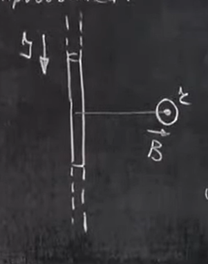
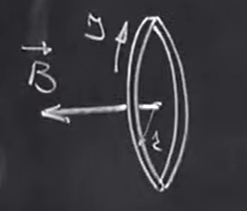
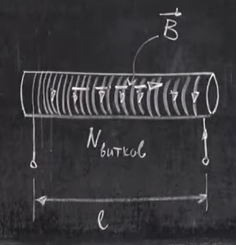
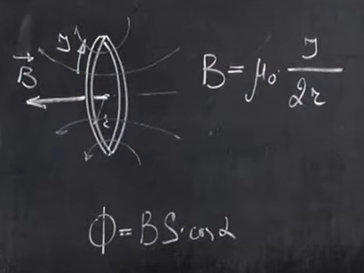
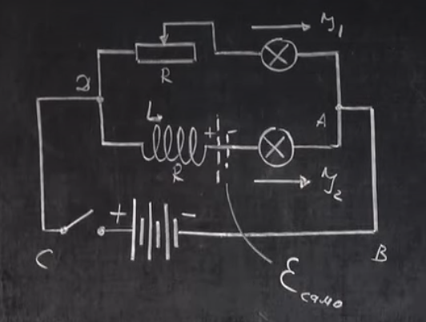
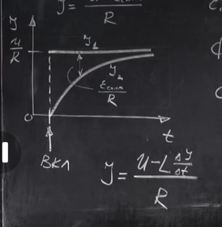

# Урок 287. Індуктивність контура (котушки). Явище самоіндукції
## Деякі корисні формули (без виведення)
### а) Магнітне поле нескінченного прямого провідника.
  
Знаходимо магнітне поле в точці $r$.  
$B = \mu_0 \frac{I}{2\pi r}$, де  
$I$ - струм у провіднику,  
$\mu_0$ - магнітна стала, $\mu_0 = 4\pi \cdot 10^{-7} \frac{Тл \cdot м}{А}$,  
$r$ - відстань від провідника до точки спостереження.
### б) Магнітне поле в центрі кругового струму
  
$B = \mu_0 \frac{I}{2r}$, де
$I$ - струм у провіднику,  
$\mu_0$ - магнітна стала,  
$r$ - радіус кола.
### в) Магнітне поле соленоїда
  
**Соленоїд** - це котушка з рівномірно розподіленими витками, довжина якої значно більша за її радіус. Всередині соленоїда буде однорідне магнітне поле, а зовні - практично відсутнє.  
$B = \mu_0 \frac{N}{l} I$, де  
$N$ - кількість витків,  
$l$ - довжина соленоїда,  
$I$ - струм у провіднику,

## Індуктивність контура (котушки)
Магнітний потік $\Phi = B \cdot S \cdot cos(\alpha)$  
З попередніх формул видно, що $B \sim I$, тому:  
$\Phi \sim I$   
$\frac{\Phi}{I}$ - не залежить від сили струму $I$, а є характеристикою контура.  
  
Якщо подивитися на один виток, можна побачити, що магнітний потік збільшиться при збільшенні площі витка, отже величина $\frac{\Phi}{I}$ також збільшиться. Хоч радіус і впливає на $B$, збільшення площі більше впливатиме на збільшення магнітного потоку, бо $S = \pi r^2$.

**Індуктивність контура**:  
$$ L = \frac{\Phi}{I} $$
**Індуктивністю контура(котушки)** називається фізична величина, що дорівнює відношенню магнітного потоку, що створений струмом у цьому контурі (котушці) до сили струму.  
$[L] = \frac{Вб}{А} = Гн$ (Генрі)$
1 Генрі - це індуктивність такого контура, в якому струм силою в 1 А створює магнітний потік в 1 Вб. Тобто це якби характеристика контура, яка впливає на те, який потік в ньому створиться тим чи іншим струмом (в котушці з однією індуктивністю струм 1 А створить такий-то магнітний потік, в котушці з іншою індуктивністю струм 1 А створить інший магнітний потік).

## Розрахунок індуктивності соленоїда
$\Phi = \Phi_1 \cdot N$, де $\Phi_1$ - магнітний потік одного витка, $N$ - кількість витків.  
$\Phi_1 = B \cdot S$  
Через кожен із витків соленоїда проходить однаковий магнітний потік (однорідне магнітне поле).  
$B = \mu_0 \frac{N}{l} I$  
$\Phi_1 = \mu_0 \frac{N}{l} I \cdot S$  
$\Phi = \Phi_1 \cdot N = \mu_0 \frac{N}{l} I \cdot S \cdot N = \mu_0 \frac{N^2}{l} I \cdot S$  
$\Phi$ - це магнітний потік через **весь** соленоїд.  
$L = \frac{\Phi}{I} = \mu_0 \frac{N^2}{l} S$  
Формула для розрахунку індуктивності соленоїда.
$$L = \mu_0 N^2 \frac{S}{l} $$
Цю формулу можна написати ще одним способом:  
$n = \frac{N}{l}$ - густина намотки (кількість витків на одиницю довжини).  
$L = \mu_0 \frac{N^2 \cdot S \cdot l}{l^2}$  
$$L = \mu_0 n^2 S l$$
$S \cdot l$ - це об'єм, що займає магнітне поле в соленоїді.

## Якщо сила струму змінюється
Котушка (контур), $I$ змінюється => $B$ змінюється => $\Phi$ змінюється => з'являється ЕРС самоіндукції.  
Це називається явище самоіндукції.  
Явище виникнення ЕРС індукції в електричному колі при зміні сили струму в цьому колі називається **самоіндукцією**.  

Підберемо таке електричне коло, в якому опір котушки буде дорівнювати опору реостата(резистор змінного опору).  
Коли ми замикаємо коло, лампа в частині з реостатом загориться моментально, а лампа в частині з котушкою загориться повільно із затримкою.
  

На графіку показано, як змінюється струм на лампочці, що включена через резистор, і як змінюється струм на лампочці, що включена через котушку.  
  

Коли ми замикаємо ключ, то в котушці починає змінюватися струм, виникає ЕРС самоіндукції, вона за правилом Ленца перешкоджає збільшенню магнітного поля в котушці, а отже перешкоджає збільшенню струму. На певний час з'являється додаткове "джерело струму", що увімкнено назустріч.  

Запишемо друге правило Кірхгофа для контура $ABCDA$ з котушкою:  
$\varepsilon + \varepsilon_{самоіндукції} = I \cdot R$  
$I = \frac{U + \varepsilon_{самоіндукції}}{R}$  
За правилом Ленца: $\varepsilon_{самоіндукції} = - \frac{d\Phi}{dt}$. 
$\Phi = L \cdot I$  
$\varepsilon_{самоіндукції} = - L \frac{dI}{dt}$  

$$I = \frac{U - L \frac{dI}{dt}}{R}$$
На початку часу після перемикання, коли струм швидко міняється, величина $\frac{dI}{dt}$ велика, тому ЕРС самоіндукції найбільше перешкоджає збільшенню струму. По мірі того, як струм наближається до значення $U/R$, він змінюється не настільки швидко і з напруги віднімається менша величина.